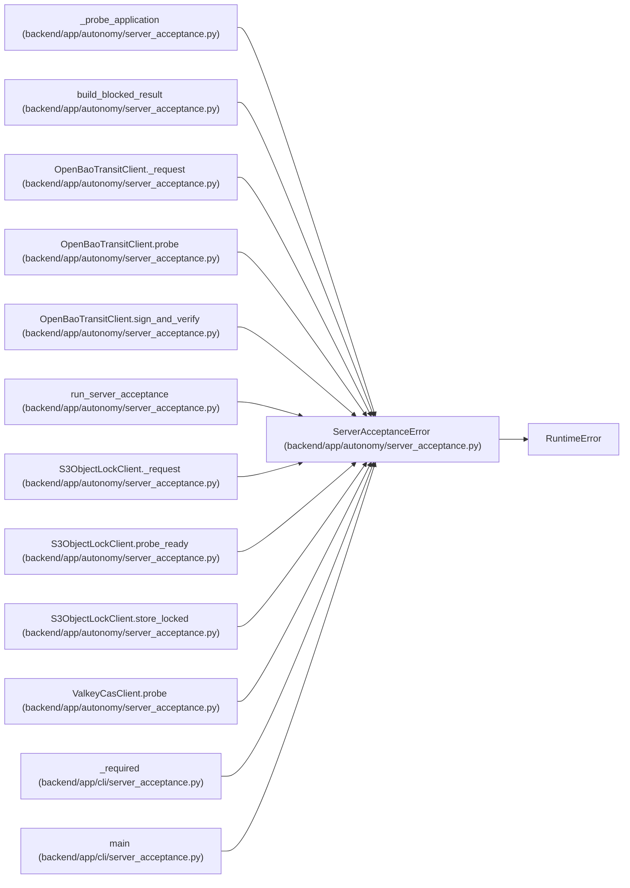

# ServerAcceptanceError

**Location:** `backend/app/autonomy/server_acceptance.py:43`
**Kind:** Class
**Bases:** `RuntimeError`
**Module:** [autonomy_server_acceptance](../modules/autonomy_server_acceptance.md)

## Description

A sanitized, stable failure from one server-acceptance predicate.

## Attributes

*No annotated attributes found.*

## Methods

| Method | Signature | Decorators | Description |
|--------|-----------|------------|-------------|
| `__init__` | `(code: str, *, cause: BaseException \| None = None) -> None` | — | — |

## Relationships

<!-- Auto-generated relationship summary. Do not edit by hand. -->

### Summary

| Module | Methods | Attributes |
|---|---:|---|
| [autonomy_server_acceptance](../modules/autonomy_server_acceptance.md) | 1 | — |

### Structure

| Kind | Entity | Module |
|---|---|---|
| Base | `RuntimeError` | — |

### References

| Reference | Kind | Source | Call sites |
|---|---|---|---:|
| `_probe_application` | call | [autonomy_server_acceptance](../modules/autonomy_server_acceptance.md) | 9 |
| `build_blocked_result` | type_reference | [autonomy_server_acceptance](../modules/autonomy_server_acceptance.md) | — |
| `OpenBaoTransitClient._request` | call | [autonomy_server_acceptance](../modules/autonomy_server_acceptance.md) | 2 |
| `OpenBaoTransitClient.probe` | call | [autonomy_server_acceptance](../modules/autonomy_server_acceptance.md) | 6 |
| `OpenBaoTransitClient.sign_and_verify` | call | [autonomy_server_acceptance](../modules/autonomy_server_acceptance.md) | 3 |
| `run_server_acceptance` | call | [autonomy_server_acceptance](../modules/autonomy_server_acceptance.md) | 7 |
| `S3ObjectLockClient._request` | call | [autonomy_server_acceptance](../modules/autonomy_server_acceptance.md) | 1 |
| `S3ObjectLockClient.probe_ready` | call | [autonomy_server_acceptance](../modules/autonomy_server_acceptance.md) | 2 |
| `S3ObjectLockClient.store_locked` | call | [autonomy_server_acceptance](../modules/autonomy_server_acceptance.md) | 9 |
| `ValkeyCasClient.probe` | call | [autonomy_server_acceptance](../modules/autonomy_server_acceptance.md) | 7 |
| `_required` | call | [cli_server_acceptance](../modules/cli_server_acceptance.md) | 1 |
| `main` | call | [cli_server_acceptance](../modules/cli_server_acceptance.md) | 2 |

> References: showing 12 of 13 logical references; 1 omitted by the 12-row generated summary limit.
