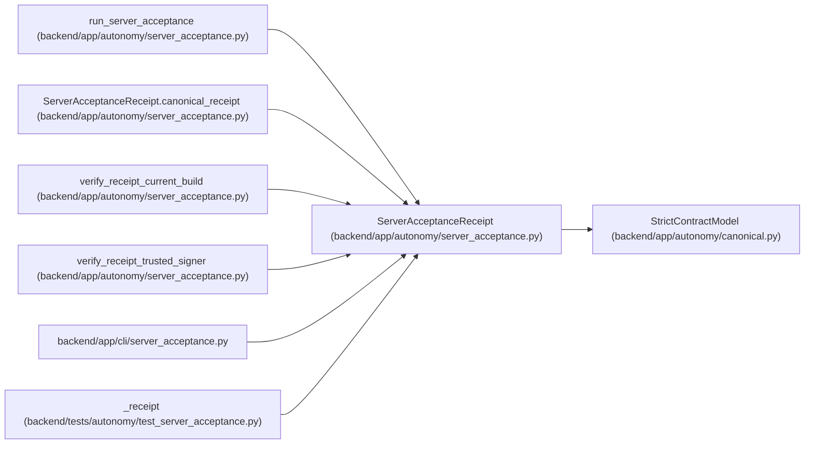

# ServerAcceptanceReceipt

**Location:** `backend/app/autonomy/server_acceptance.py:191`
**Kind:** Pydantic model
**Bases:** `StrictContractModel`
**Module:** [autonomy_server_acceptance](../modules/autonomy_server_acceptance.md)

## Description

_Auto-generated from `ServerAcceptanceReceipt` in `backend/app/autonomy/server_acceptance.py`._

## Validators

| Method | Scope | Fields | Mode | Options |
|--------|-------|--------|------|---------|
| `canonical_receipt` | model | — | after | — |

## Attributes

| Name | Type | Wire name | Required | Nullable | Default | Constraints | Examples | Description |
|------|------|-----------|----------|----------|---------|-------------|-------------|----------|
| `schema_version` | `Literal['workchord-self-hosted-server-acceptance-v1']` | `schema_version` | No | No | `'workchord-self-hosted-server-acceptance-v1'` | — | — | — |
| `decision` | `Literal['SELF-HOSTED-SERVER-ACCEPTED']` | `decision` | No | No | `'SELF-HOSTED-SERVER-ACCEPTED'` | — | — | — |
| `candidate` | `ServerAcceptanceCandidate` | `candidate` | Yes | No | — | — | — | — |
| `valid_until` | `datetime` | `valid_until` | Yes | No | — | — | — | — |
| `remote_signature` | `str` | `remote_signature` | Yes | No | — | pattern='^vault:v[1-9][0-9]*:[A-Za-z0-9+/=]+$' | — | — |
| `signature_verified` | `Literal[True]` | `signature_verified` | No | No | `True` | — | — | — |
| `evidence_object` | `LockedAcceptanceObject` | `evidence_object` | Yes | No | — | — | — | — |
| `receipt_signature` | `str` | `receipt_signature` | Yes | No | — | pattern='^vault:v[1-9][0-9]*:[A-Za-z0-9+/=]+$' | — | — |
| `receipt_signature_verified` | `Literal[True]` | `receipt_signature_verified` | No | No | `True` | — | — | — |
| `accepted_as_production_evidence` | `Literal[False]` | `accepted_as_production_evidence` | No | No | `False` | — | — | — |
| `accepted_as_zero_human_evidence` | `Literal[False]` | `accepted_as_zero_human_evidence` | No | No | `False` | — | — | — |
| `production_autonomy_qualified` | `Literal[False]` | `production_autonomy_qualified` | No | No | `False` | — | — | — |
| `production_gates_satisfied` | `Literal[False]` | `production_gates_satisfied` | No | No | `False` | — | — | — |
| `production_program_decision` | `Literal['NO-SHIP']` | `production_program_decision` | No | No | `'NO-SHIP'` | — | — | — |
| `receipt_digest` | `str` | `receipt_digest` | Yes | No | — | pattern=unknown (SHA256_PATTERN) | — | — |

## Methods

| Method | Signature | Decorators | Description |
|--------|-----------|------------|-------------|
| `canonical_receipt` | `() -> 'ServerAcceptanceReceipt'` | `@model_validator(mode='after')` | — |

## Relationships

<!-- Auto-generated relationship summary. Do not edit by hand. -->

### Summary

| Module | Methods | Attributes |
|---|---:|---|
| [autonomy_server_acceptance](../modules/autonomy_server_acceptance.md) | 1 | `accepted_as_production_evidence`, `accepted_as_zero_human_evidence`, `candidate`, `decision`, `evidence_object`, `production_autonomy_qualified`, `production_gates_satisfied`, `production_program_decision`, `receipt_digest`, `receipt_signature`, `receipt_signature_verified`, `remote_signature` |

### Structure

| Kind | Entity | Module |
|---|---|---|
| Base | `StrictContractModel` | [autonomy_canonical](../modules/autonomy_canonical.md) |

### References

| Reference | Kind | Source | Call sites |
|---|---|---|---:|
| `run_server_acceptance` | call | [autonomy_server_acceptance](../modules/autonomy_server_acceptance.md) | 1 |
| `run_server_acceptance` | type_reference | [autonomy_server_acceptance](../modules/autonomy_server_acceptance.md) | — |
| `ServerAcceptanceReceipt.canonical_receipt` | type_reference | [autonomy_server_acceptance](../modules/autonomy_server_acceptance.md) | — |
| `verify_receipt_current_build` | type_reference | [autonomy_server_acceptance](../modules/autonomy_server_acceptance.md) | — |
| `verify_receipt_trusted_signer` | type_reference | [autonomy_server_acceptance](../modules/autonomy_server_acceptance.md) | — |
| `server_acceptance` | import | [cli_server_acceptance](../modules/cli_server_acceptance.md) | — |
| `_receipt` | call | [test_server_acceptance](../modules/test_server_acceptance.md) | 1 |
| `_receipt` | type_reference | [test_server_acceptance](../modules/test_server_acceptance.md) | — |
