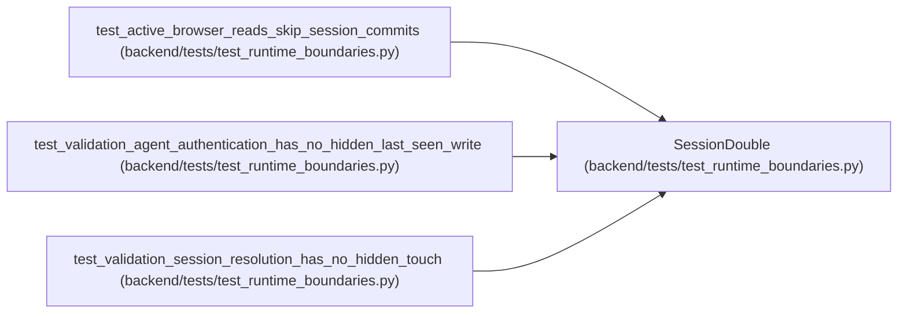

# SessionDouble

**Location:** `backend/tests/test_runtime_boundaries.py:44`
**Kind:** Class
**Bases:** —
**Module:** [test_runtime_boundaries](../modules/test_runtime_boundaries.md)

## Description

_Auto-generated from `SessionDouble` in `backend/tests/test_runtime_boundaries.py`._

## Attributes

*No annotated attributes found.*

## Methods

| Method | Signature | Decorators | Description |
|--------|-----------|------------|-------------|
| `__init__` | `(resolved_session: UserSession \| None)` | — | — |
| `execute` | *(async)* `(_statement: Any) -> ScalarResult` | — | — |
| `commit` | *(async)* `() -> None` | — | — |
| `refresh` | *(async)* `(_instance: Any) -> None` | — | — |

## Relationships

<!-- Auto-generated relationship summary. Do not edit by hand. -->

### Summary

| Module | Methods | Attributes |
|---|---:|---|
| [test_runtime_boundaries](../modules/test_runtime_boundaries.md) | 4 | — |

### References

| Reference | Kind | Source | Call sites |
|---|---|---|---:|
| `test_active_browser_reads_skip_session_commits` | call | [test_runtime_boundaries](../modules/test_runtime_boundaries.md) | 1 |
| `test_validation_agent_authentication_has_no_hidden_last_seen_write` | call | [test_runtime_boundaries](../modules/test_runtime_boundaries.md) | 1 |
| `test_validation_session_resolution_has_no_hidden_touch` | call | [test_runtime_boundaries](../modules/test_runtime_boundaries.md) | 1 |
