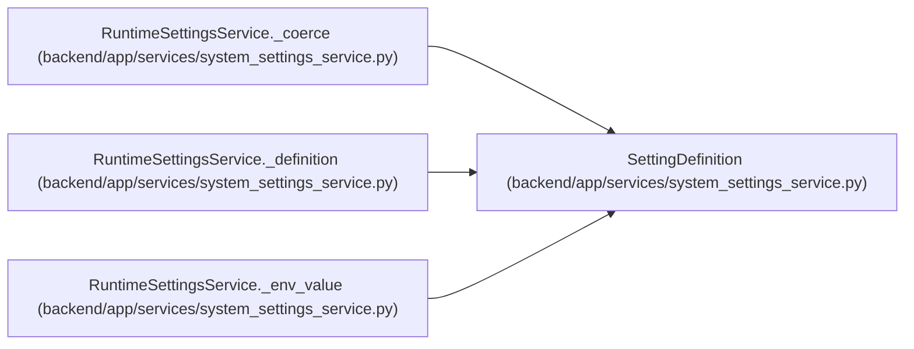

# SettingDefinition

**Location:** `backend/app/services/system_settings_service.py:45`
**Kind:** Class
**Bases:** —
**Module:** [system_settings_service](../modules/system_settings_service.md)

**Decorators:** `@dataclass(frozen=True)`

## Description

Catalog definition for one writable runtime setting.

## Attributes

| Name | Type | Default | Description |
|------|------|---------|-------------|
| `key` | `str` | *required* | — |
| `category` | `str` | *required* | — |
| `field` | `str` | *required* | — |
| `env_attr` | `str` | *required* | — |
| `default` | `Any` | *required* | — |
| `is_secret` | `bool` | `False` | — |
| `value_type` | `type` | `str` | — |

## Methods

*No public methods. Inherits from base classes.*

## Relationships

<!-- Auto-generated relationship summary. Do not edit by hand. -->

### Summary

| Module | Methods | Attributes |
|---|---:|---|
| [system_settings_service](../modules/system_settings_service.md) | 0 | `category`, `default`, `env_attr`, `field`, `is_secret`, `key`, `value_type` |

### References

| Reference | Kind | Source | Call sites |
|---|---|---|---:|
| `RuntimeSettingsService._coerce` | type_reference | [system_settings_service](../modules/system_settings_service.md) | — |
| `RuntimeSettingsService._definition` | type_reference | [system_settings_service](../modules/system_settings_service.md) | — |
| `RuntimeSettingsService._env_value` | type_reference | [system_settings_service](../modules/system_settings_service.md) | — |
