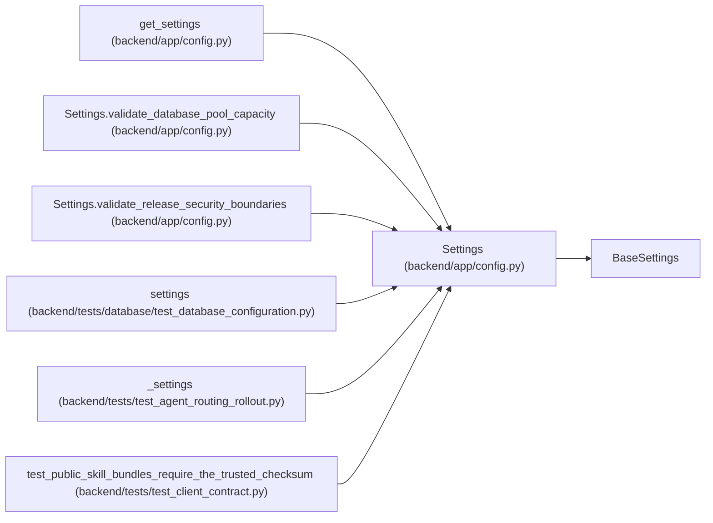

# Settings

**Location:** `backend/app/config.py:12`
**Kind:** Pydantic model
**Bases:** `BaseSettings`
**Module:** [config](../modules/config.md)

## Description

Application settings.

## Validators

| Method | Scope | Fields | Mode | Options |
|--------|-------|--------|------|---------|
| `normalize_debug_flag` | field | debug | before | — |
| `require_explicit_cors_origins` | field | cors_origins | after | — |
| `normalize_skill_bundle_trust_pin` | field | agent_skill_bundle_trusted_checksums_sha256 | before | — |
| `validate_agent_team_credential_sink_ref` | field | agent_team_credential_sink_ref | after | — |
| `validate_skill_bundle_trust_pin` | field | agent_skill_bundle_trusted_checksums_sha256 | after | — |
| `validate_mcp_allowed_hosts` | field | mcp_allowed_hosts | after | — |
| `validate_mcp_allowed_origins` | field | mcp_allowed_origins | after | — |
| `validate_trusted_proxy_ips` | field | trusted_proxy_ips | after | — |
| `validate_release_security_boundaries` | model | — | after | — |
| `validate_database_pool_size` | field | database_pool_size | after | — |
| `validate_database_max_overflow` | field | database_max_overflow | after | — |
| `validate_database_pool_timeout` | field | database_pool_timeout_seconds | after | — |
| `validate_database_pool_recycle` | field | database_pool_recycle_seconds | after | — |
| `validate_database_connect_timeout` | field | database_connect_timeout_seconds | after | — |
| `validate_database_statement_timeout` | field | database_statement_timeout_ms | after | — |
| `validate_database_lock_timeout` | field | database_lock_timeout_ms | after | — |
| `validate_database_pool_capacity` | model | — | after | — |
| `validate_session_cookie_name` | field | session_cookie_name | after | — |
| `validate_session_lifetime` | field | session_max_age_seconds | after | — |
| `validate_session_touch_interval` | field | session_touch_interval_seconds | after | — |
| `validate_agent_last_seen_interval` | field | agent_last_seen_interval_seconds | after | — |
| `validate_database_readiness_timeout` | field | database_readiness_timeout_seconds | after | — |
| `validate_slow_query_threshold` | field | database_slow_query_threshold_ms | after | — |
| `validate_maintenance_identity` | field | maintenance_revision, maintenance_replica_id | after | — |
| `validate_maintenance_retry_after` | field | maintenance_retry_after_seconds | after | — |
| `validate_maintenance_allowlist` | field | maintenance_validation_allowlist | after | — |
| `validate_delivery_poll_seconds` | field | outbound_delivery_poll_seconds | after | — |
| `validate_delivery_batch_size` | field | outbound_delivery_batch_size | after | — |

## Attributes

| Name | Type | Wire name | Required | Nullable | Default | Constraints | Examples | Description |
|------|------|-----------|----------|----------|---------|-------------|-------------|----------|
| `database_url` | `str` | `database_url` | No | No | `'sqlite+aiosqlite:///./workchord.db'` | — | — | — |
| `deployment_environment` | `Literal['development', 'test', 'production']` | `deployment_environment` | No | No | `'development'` | — | — | — |
| `database_postgresql_required` | `bool` | `database_postgresql_required` | No | No | `False` | — | — | — |
| `database_process_role` | `Literal['web', 'delivery_worker', 'migration', 'repair']` | `database_process_role` | No | No | `'web'` | — | — | — |
| `database_pool_size` | `int` | `database_pool_size` | No | No | `15` | — | — | — |
| `database_max_overflow` | `int` | `database_max_overflow` | No | No | `5` | — | — | — |
| `database_pool_timeout_seconds` | `float` | `database_pool_timeout_seconds` | No | No | `30.0` | — | — | — |
| `database_pool_recycle_seconds` | `int` | `database_pool_recycle_seconds` | No | No | `1800` | — | — | — |
| `database_pool_pre_ping` | `bool` | `database_pool_pre_ping` | No | No | `True` | — | — | — |
| `database_connect_timeout_seconds` | `int` | `database_connect_timeout_seconds` | No | No | `10` | — | — | — |
| `database_statement_timeout_ms` | `int` | `database_statement_timeout_ms` | No | No | `30000` | — | — | — |
| `database_lock_timeout_ms` | `int` | `database_lock_timeout_ms` | No | No | `5000` | — | — | — |
| `database_application_name` | `str` | `database_application_name` | No | No | `'workchord'` | — | — | — |
| `database_session_role` | `str` | `database_session_role` | No | No | `''` | — | — | — |
| `database_ssl_mode` | `Literal['disable', 'allow', 'prefer', 'require', 'verify-ca', 'verify-full']` | `database_ssl_mode` | No | No | `'prefer'` | — | — | — |
| `database_ssl_root_cert` | `str` | `database_ssl_root_cert` | No | No | `''` | — | — | — |
| `database_ssl_cert` | `str` | `database_ssl_cert` | No | No | `''` | — | — | — |
| `database_ssl_key` | `str` | `database_ssl_key` | No | No | `''` | — | — | — |
| `database_readiness_timeout_seconds` | `float` | `database_readiness_timeout_seconds` | No | No | `2.0` | — | — | — |
| `database_slow_query_threshold_ms` | `int` | `database_slow_query_threshold_ms` | No | No | `500` | — | — | — |
| `api_prefix` | `str` | `api_prefix` | No | No | `'/api'` | — | — | — |
| `debug` | `bool` | `debug` | No | No | `False` | — | — | — |
| `llm_provider` | `Literal['openai', 'openrouter', 'nvidia', 'custom']` | `llm_provider` | No | No | `'openai'` | — | — | — |
| `llm_api_key` | `str` | `llm_api_key` | No | No | `''` | — | — | — |
| `llm_api_url` | `str` | `llm_api_url` | No | No | `''` | — | — | — |
| `llm_model` | `str` | `llm_model` | No | No | `'gpt-4'` | — | — | — |
| `llm_temperature` | `float` | `llm_temperature` | No | No | `0.2` | — | — | — |
| `llm_max_output_tokens` | `int` | `llm_max_output_tokens` | No | No | `3000` | — | — | — |
| `app_ui_language` | `Literal['en', 'ru']` | `app_ui_language` | No | No | `'en'` | — | — | — |
| `ai_language_mode` | `Literal['auto', 'en', 'ru']` | `ai_language_mode` | No | No | `'auto'` | — | — | — |
| `github_api_url` | `str` | `github_api_url` | No | No | `'https://api.github.com'` | — | — | — |
| `github_token` | `str` | `github_token` | No | No | `''` | — | — | — |
| `github_request_timeout_seconds` | `float` | `github_request_timeout_seconds` | No | No | `10.0` | — | — | — |
| `github_webhook_secret` | `str` | `github_webhook_secret` | No | No | `''` | — | — | — |
| `github_webhook_create_triage_for_unmatched` | `bool` | `github_webhook_create_triage_for_unmatched` | No | No | `False` | — | — | — |
| `web_intake_token` | `str` | `web_intake_token` | No | No | `''` | — | — | — |
| `web_intake_rate_limit_per_minute` | `int` | `web_intake_rate_limit_per_minute` | No | No | `30` | — | — | — |
| `cors_origins` | `list[str]` | `cors_origins` | No | No | `['http://localhost:5173', 'http://localhost:3000']` | — | — | — |
| `smtp_host` | `str` | `smtp_host` | No | No | `''` | — | — | — |
| `smtp_port` | `int` | `smtp_port` | No | No | `587` | — | — | — |
| `smtp_user` | `str` | `smtp_user` | No | No | `''` | — | — | — |
| `smtp_password` | `str` | `smtp_password` | No | No | `''` | — | — | — |
| `smtp_from_email` | `str` | `smtp_from_email` | No | No | `'notifications@workchord.local'` | — | — | — |
| `smtp_use_tls` | `bool` | `smtp_use_tls` | No | No | `True` | — | — | — |
| `notifications_enabled` | `bool` | `notifications_enabled` | No | No | `False` | — | — | — |
| `outbound_delivery_worker_enabled` | `bool` | `outbound_delivery_worker_enabled` | No | No | `False` | — | — | — |
| `outbound_delivery_poll_seconds` | `float` | `outbound_delivery_poll_seconds` | No | No | `1.0` | — | — | — |
| `outbound_delivery_batch_size` | `int` | `outbound_delivery_batch_size` | No | No | `50` | — | — | — |
| `settings_encryption_key` | `str` | `settings_encryption_key` | No | No | `''` | — | — | — |
| `agent_bootstrap_api_key` | `str` | `agent_bootstrap_api_key` | No | No | `''` | — | — | — |
| `agent_team_credential_sink_dir` | `str` | `agent_team_credential_sink_dir` | No | No | `''` | — | — | — |
| `agent_team_credential_sink_ref` | `str` | `agent_team_credential_sink_ref` | No | No | `'agent-team-secure-sink'` | — | — | — |
| `agent_skill_bundles_public` | `bool` | `agent_skill_bundles_public` | No | No | `False` | — | — | — |
| `agent_skill_bundle_trusted_checksums_sha256` | `str` | `agent_skill_bundle_trusted_checksums_sha256` | No | No | `''` | — | — | — |
| `agent_skill_bundle_max_artifacts` | `int` | `agent_skill_bundle_max_artifacts` | No | No | `256` | — | — | — |
| `agent_skill_bundle_max_artifact_bytes` | `int` | `agent_skill_bundle_max_artifact_bytes` | No | No | `64 * 1024 * 1024` | — | — | — |
| `agent_skill_bundle_max_total_bytes` | `int` | `agent_skill_bundle_max_total_bytes` | No | No | `512 * 1024 * 1024` | — | — | — |
| `agent_skill_bundle_max_metadata_bytes` | `int` | `agent_skill_bundle_max_metadata_bytes` | No | No | `2 * 1024 * 1024` | — | — | — |
| `agent_skill_bundle_max_file_bytes` | `int` | `agent_skill_bundle_max_file_bytes` | No | No | `2 * 1024 * 1024` | — | — | — |
| `model_aware_routing_mode` | `Literal['off', 'shadow', 'enforced']` | `model_aware_routing_mode` | No | No | `'off'` | — | — | — |
| `mcp_dns_rebinding_protection` | `bool` | `mcp_dns_rebinding_protection` | No | No | `True` | — | — | — |
| `mcp_allowed_hosts` | `list[str]` | `mcp_allowed_hosts` | No | No | `['localhost:*', '127.0.0.1:*', '[::1]:*', 'testserver']` | — | — | — |
| `mcp_allowed_origins` | `list[str]` | `mcp_allowed_origins` | No | No | `['http://localhost:*', 'http://127.0.0.1:*', 'http://testserver']` | — | — | — |
| `mcp_http_host` | `str` | `mcp_http_host` | No | No | `'127.0.0.1'` | — | — | — |
| `mcp_unsafe_allow_public_binding` | `bool` | `mcp_unsafe_allow_public_binding` | No | No | `False` | — | — | — |
| `workchord_admin_api_key` | `str` | `workchord_admin_api_key` | No | No | `''` | — | — | — |
| `workchord_auth_mode` | `Literal['managed', 'trusted_local']` | `workchord_auth_mode` | No | No | `'managed'` | — | — | — |
| `oidc_issuer_url` | `str` | `oidc_issuer_url` | No | No | `''` | — | — | — |
| `oidc_client_id` | `str` | `oidc_client_id` | No | No | `''` | — | — | — |
| `oidc_client_secret` | `str` | `oidc_client_secret` | No | No | `''` | — | — | — |
| `oidc_redirect_uri` | `str` | `oidc_redirect_uri` | No | No | `''` | — | — | — |
| `oidc_allow_http_loopback` | `bool` | `oidc_allow_http_loopback` | No | No | `False` | — | — | — |
| `auth_session_max_age_seconds` | `int` | `auth_session_max_age_seconds` | No | No | `8 * 60 * 60` | — | — | — |
| `session_metadata_retention_days` | `int` | `session_metadata_retention_days` | No | No | `30` | — | — | — |
| `snapshot_retention_count` | `int` | `snapshot_retention_count` | No | No | `10` | — | — | — |
| `snapshot_max_bytes` | `int` | `snapshot_max_bytes` | No | No | `8 * 1024 * 1024` | — | — | — |
| `allow_private_egress_urls` | `bool` | `allow_private_egress_urls` | No | No | `False` | — | — | — |
| `trusted_proxy_ips` | `list[str]` | `trusted_proxy_ips` | No | No | `[]` | — | — | — |
| `session_cookie_name` | `str` | `session_cookie_name` | No | No | `'workchord_session'` | — | — | — |
| `session_cookie_secure` | `bool` | `session_cookie_secure` | No | No | `True` | — | — | — |
| `session_max_age_seconds` | `int` | `session_max_age_seconds` | No | No | `30 * 24 * 60 * 60` | — | — | — |
| `session_touch_interval_seconds` | `int` | `session_touch_interval_seconds` | No | No | `300` | — | — | — |
| `agent_last_seen_interval_seconds` | `int` | `agent_last_seen_interval_seconds` | No | No | `300` | — | — | — |
| `maintenance_mode` | `Literal['off', 'read-only-maintenance', 'validation-only']` | `maintenance_mode` | No | No | `'off'` | — | — | — |
| `maintenance_revision` | `str` | `maintenance_revision` | No | No | `'development'` | — | — | — |
| `maintenance_replica_id` | `str` | `maintenance_replica_id` | No | No | `'local'` | — | — | — |
| `maintenance_retry_after_seconds` | `int` | `maintenance_retry_after_seconds` | No | No | `60` | — | — | — |
| `maintenance_validation_allowlist` | `list[str]` | `maintenance_validation_allowlist` | No | No | `['/health', '/health/live', '/health/ready', '/metrics']` | — | — | — |

## Methods

| Method | Signature | Decorators | Description |
|--------|-----------|------------|-------------|
| `normalize_debug_flag` | `(value: Any) -> Any` | `@field_validator('debug', mode='before')`, `@classmethod` | — |
| `require_explicit_cors_origins` | `(value: list[str]) -> list[str]` | `@field_validator('cors_origins')`, `@classmethod` | Credentialed browser sessions require an explicit origin allowlist. |
| `normalize_skill_bundle_trust_pin` | `(value: Any) -> Any` | `@field_validator('agent_skill_bundle_trusted_checksums_sha256', mode='before')`, `@classmethod` | — |
| `validate_agent_team_credential_sink_ref` | `(value: str) -> str` | `@field_validator('agent_team_credential_sink_ref')`, `@classmethod` | — |
| `validate_skill_bundle_trust_pin` | `(value: str) -> str` | `@field_validator('agent_skill_bundle_trusted_checksums_sha256')`, `@classmethod` | — |
| `validate_mcp_allowed_hosts` | `(value: list[str]) -> list[str]` | `@field_validator('mcp_allowed_hosts')`, `@classmethod` | — |
| `validate_mcp_allowed_origins` | `(value: list[str]) -> list[str]` | `@field_validator('mcp_allowed_origins')`, `@classmethod` | — |
| `validate_trusted_proxy_ips` | `(value: list[str]) -> list[str]` | `@field_validator('trusted_proxy_ips')`, `@classmethod` | Accept only explicit IP addresses or CIDR networks for proxy trust. |
| `validate_release_security_boundaries` | `() -> 'Settings'` | `@model_validator(mode='after')` | — |
| `validate_database_pool_size` | `(value: int) -> int` | `@field_validator('database_pool_size')`, `@classmethod` | — |
| `validate_database_max_overflow` | `(value: int) -> int` | `@field_validator('database_max_overflow')`, `@classmethod` | — |
| `validate_database_pool_timeout` | `(value: float) -> float` | `@field_validator('database_pool_timeout_seconds')`, `@classmethod` | — |
| `validate_database_pool_recycle` | `(value: int) -> int` | `@field_validator('database_pool_recycle_seconds')`, `@classmethod` | — |
| `validate_database_connect_timeout` | `(value: int) -> int` | `@field_validator('database_connect_timeout_seconds')`, `@classmethod` | — |
| `validate_database_statement_timeout` | `(value: int) -> int` | `@field_validator('database_statement_timeout_ms')`, `@classmethod` | — |
| `validate_database_lock_timeout` | `(value: int) -> int` | `@field_validator('database_lock_timeout_ms')`, `@classmethod` | — |
| `validate_database_pool_capacity` | `() -> 'Settings'` | `@model_validator(mode='after')` | — |
| `validate_session_cookie_name` | `(value: str) -> str` | `@field_validator('session_cookie_name')`, `@classmethod` | Reject cookie names that could create malformed response headers. |
| `validate_session_lifetime` | `(value: int) -> int` | `@field_validator('session_max_age_seconds')`, `@classmethod` | Session lifetime must be positive and no longer than one year. |
| `validate_session_touch_interval` | `(value: int) -> int` | `@field_validator('session_touch_interval_seconds')`, `@classmethod` | — |
| `validate_agent_last_seen_interval` | `(value: int) -> int` | `@field_validator('agent_last_seen_interval_seconds')`, `@classmethod` | — |
| `validate_database_readiness_timeout` | `(value: float) -> float` | `@field_validator('database_readiness_timeout_seconds')`, `@classmethod` | — |
| `validate_slow_query_threshold` | `(value: int) -> int` | `@field_validator('database_slow_query_threshold_ms')`, `@classmethod` | — |
| `validate_maintenance_identity` | `(value: str) -> str` | `@field_validator('maintenance_revision', 'maintenance_replica_id')`, `@classmethod` | — |
| `validate_maintenance_retry_after` | `(value: int) -> int` | `@field_validator('maintenance_retry_after_seconds')`, `@classmethod` | — |
| `validate_maintenance_allowlist` | `(value: list[str]) -> list[str]` | `@field_validator('maintenance_validation_allowlist')`, `@classmethod` | — |
| `validate_delivery_poll_seconds` | `(value: float) -> float` | `@field_validator('outbound_delivery_poll_seconds')`, `@classmethod` | — |
| `validate_delivery_batch_size` | `(value: int) -> int` | `@field_validator('outbound_delivery_batch_size')`, `@classmethod` | — |

## Relationships

<!-- Auto-generated relationship summary. Do not edit by hand. -->

### Summary

| Module | Methods | Attributes |
|---|---:|---|
| [config](../modules/config.md) | 28 | `agent_bootstrap_api_key`, `agent_last_seen_interval_seconds`, `agent_skill_bundle_max_artifact_bytes`, `agent_skill_bundle_max_artifacts`, `agent_skill_bundle_max_file_bytes`, `agent_skill_bundle_max_metadata_bytes`, `agent_skill_bundle_max_total_bytes`, `agent_skill_bundle_trusted_checksums_sha256`, `agent_skill_bundles_public`, `agent_team_credential_sink_dir`, `agent_team_credential_sink_ref`, `ai_language_mode` |

### Structure

| Kind | Entity | Module |
|---|---|---|
| Base | `BaseSettings` | — |

### References

| Reference | Kind | Source | Call sites |
|---|---|---|---:|
| `get_settings` | call | [config](../modules/config.md) | 1 |
| `get_settings` | type_reference | [config](../modules/config.md) | — |
| `Settings.validate_database_pool_capacity` | type_reference | [config](../modules/config.md) | — |
| `Settings.validate_release_security_boundaries` | type_reference | [config](../modules/config.md) | — |
| `settings` | call | [test_database_configuration](../modules/test_database_configuration.md) | 1 |
| `settings` | type_reference | [test_database_configuration](../modules/test_database_configuration.md) | — |
| `_settings` | call | [test_agent_routing_rollout](../modules/test_agent_routing_rollout.md) | 1 |
| `_settings` | type_reference | [test_agent_routing_rollout](../modules/test_agent_routing_rollout.md) | — |
| `test_public_skill_bundles_require_the_trusted_checksum` | call | [test_client_contract](../modules/test_client_contract.md) | 2 |
