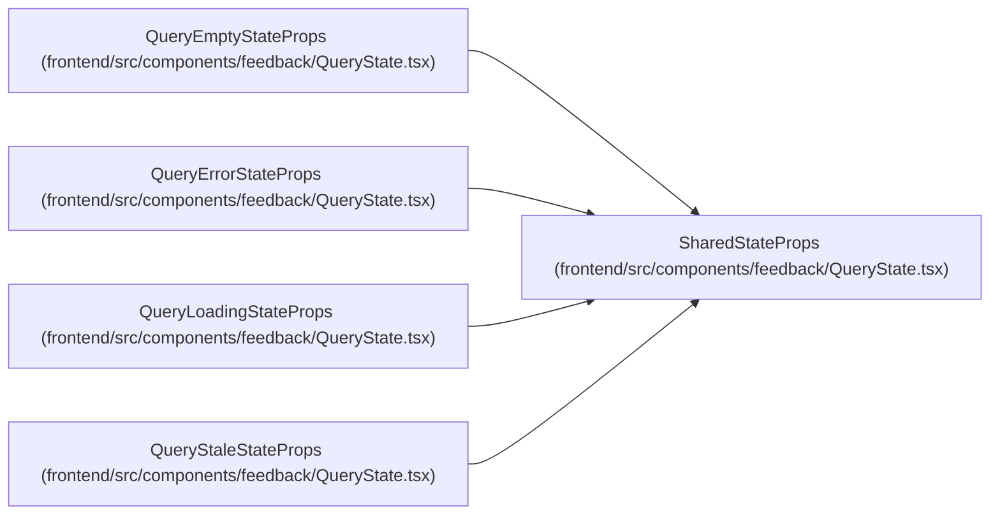

# SharedStateProps

**Location:** `frontend/src/components/feedback/QueryState.tsx:7`
**Kind:** Class
**Bases:** —
**Module:** [QueryState](../modules/QueryState.md)

## Description

_Auto-generated from `SharedStateProps` in `frontend/src/components/feedback/QueryState.tsx`._

## Attributes

| Name | Type | Default | Description |
|------|------|---------|-------------|
| `className` | `string` | *required* | — |

## Methods

*No public methods. Inherits from base classes.*

## Relationships

<!-- Auto-generated relationship summary. Do not edit by hand. -->

### Summary

| Module | Methods | Attributes |
|---|---:|---|
| [QueryState](../modules/QueryState.md) | 0 | `className` |

### Structure

| Kind | Entity | Module |
|---|---|---|
| Subclass | `QueryEmptyStateProps` | [QueryState](../modules/QueryState.md) |
| Subclass | `QueryErrorStateProps` | [QueryState](../modules/QueryState.md) |
| Subclass | `QueryLoadingStateProps` | [QueryState](../modules/QueryState.md) |
| Subclass | `QueryStaleStateProps` | [QueryState](../modules/QueryState.md) |
