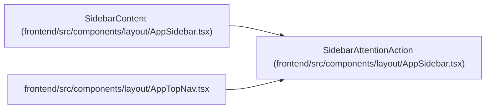

# SidebarAttentionAction

**Location:** `frontend/src/components/layout/AppSidebar.tsx:24`
**Kind:** Class
**Bases:** —
**Module:** [AppSidebar](../modules/AppSidebar.md)

## Description

_Auto-generated from `SidebarAttentionAction` in `frontend/src/components/layout/AppSidebar.tsx`._

## Attributes

| Name | Type | Default | Description |
|------|------|---------|-------------|
| `to` | `string` | *required* | — |
| `label` | `string` | *required* | — |
| `isError` | `boolean` | *required* | — |

## Methods

*No public methods. Inherits from base classes.*

## Relationships

<!-- Auto-generated relationship summary. Do not edit by hand. -->

### Summary

| Module | Methods | Attributes |
|---|---:|---|
| [AppSidebar](../modules/AppSidebar.md) | 0 | `isError`, `label`, `to` |

### References

| Reference | Kind | Source | Call sites |
|---|---|---|---:|
| `SidebarContent` | type_reference | [AppSidebar](../modules/AppSidebar.md) | — |
| `AppTopNav` | import | [AppTopNav](../modules/AppTopNav.md) | — |
