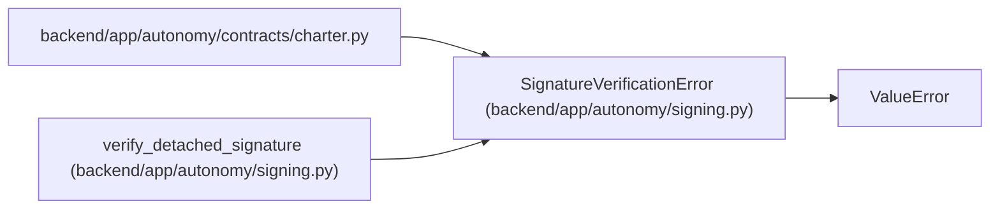

# SignatureVerificationError

**Location:** `backend/app/autonomy/signing.py:89`
**Kind:** Class
**Bases:** `ValueError`
**Module:** [signing](../modules/signing.md)

## Description

Raised when a detached remote signature fails closed.

## Attributes

*No annotated attributes found.*

## Methods

*No public methods. Inherits from base classes.*

## Relationships

<!-- Auto-generated relationship summary. Do not edit by hand. -->

### Summary

| Module | Methods | Attributes |
|---|---:|---|
| [signing](../modules/signing.md) | 0 | — |

### Structure

| Kind | Entity | Module |
|---|---|---|
| Base | `ValueError` | — |

### References

| Reference | Kind | Source | Call sites |
|---|---|---|---:|
| `charter` | import | [charter](../modules/charter.md) | — |
| `verify_detached_signature` | call | [signing](../modules/signing.md) | 11 |
