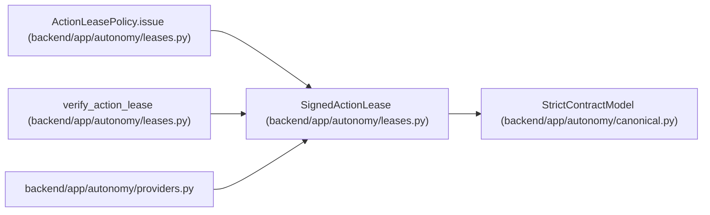

# SignedActionLease

**Location:** `backend/app/autonomy/leases.py:127`
**Kind:** Pydantic model
**Bases:** `StrictContractModel`
**Module:** [leases](../modules/leases.md)

## Description

_Auto-generated from `SignedActionLease` in `backend/app/autonomy/leases.py`._

## Attributes

| Name | Type | Wire name | Required | Nullable | Default | Constraints | Examples | Description |
|------|------|-----------|----------|----------|---------|-------------|-------------|----------|
| `lease` | `ActionLease` | `lease` | Yes | No | — | — | — | — |
| `signature` | `DetachedSignatureEnvelope` | `signature` | Yes | No | — | — | — | — |

## Methods

*No public methods. Inherits from base classes.*

## Relationships

<!-- Auto-generated relationship summary. Do not edit by hand. -->

### Summary

| Module | Methods | Attributes |
|---|---:|---|
| [leases](../modules/leases.md) | 0 | `lease`, `signature` |

### Structure

| Kind | Entity | Module |
|---|---|---|
| Base | `StrictContractModel` | [autonomy_canonical](../modules/autonomy_canonical.md) |

### References

| Reference | Kind | Source | Call sites |
|---|---|---|---:|
| `ActionLeasePolicy.issue` | call | [leases](../modules/leases.md) | 1 |
| `ActionLeasePolicy.issue` | type_reference | [leases](../modules/leases.md) | — |
| `verify_action_lease` | type_reference | [leases](../modules/leases.md) | — |
| `providers` | import | [providers](../modules/providers.md) | — |
