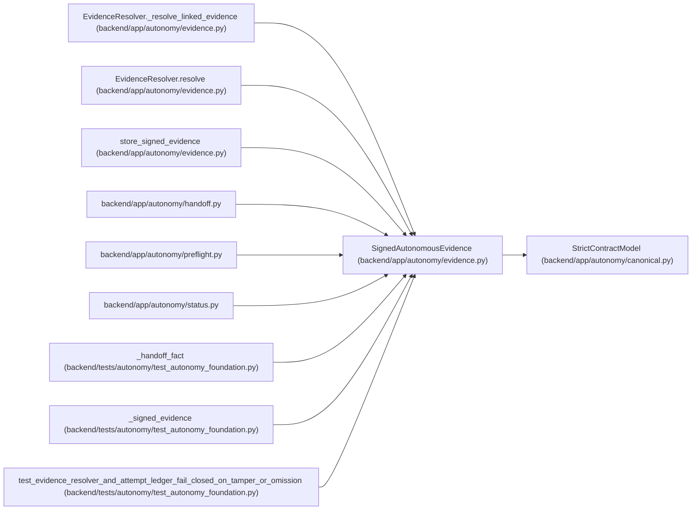

# SignedAutonomousEvidence

**Location:** `backend/app/autonomy/evidence.py:102`
**Kind:** Pydantic model
**Bases:** `StrictContractModel`
**Module:** [evidence](../modules/evidence.md)

## Description

_Auto-generated from `SignedAutonomousEvidence` in `backend/app/autonomy/evidence.py`._

## Attributes

| Name | Type | Wire name | Required | Nullable | Default | Constraints | Examples | Description |
|------|------|-----------|----------|----------|---------|-------------|-------------|----------|
| `evidence` | `AutonomousEvidence` | `evidence` | Yes | No | — | — | — | — |
| `signature` | `DetachedSignatureEnvelope` | `signature` | Yes | No | — | — | — | — |

## Methods

| Method | Signature | Decorators | Description |
|--------|-----------|------------|-------------|
| `digest` | `() -> str` | — | — |

## Relationships

<!-- Auto-generated relationship summary. Do not edit by hand. -->

### Summary

| Module | Methods | Attributes |
|---|---:|---|
| [evidence](../modules/evidence.md) | 1 | `evidence`, `signature` |

### Structure

| Kind | Entity | Module |
|---|---|---|
| Base | `StrictContractModel` | [autonomy_canonical](../modules/autonomy_canonical.md) |

### References

| Reference | Kind | Source | Call sites |
|---|---|---|---:|
| `EvidenceResolver._resolve_linked_evidence` | type_reference | [evidence](../modules/evidence.md) | — |
| `EvidenceResolver.resolve` | type_reference | [evidence](../modules/evidence.md) | — |
| `store_signed_evidence` | type_reference | [evidence](../modules/evidence.md) | — |
| `handoff` | import | [handoff](../modules/handoff.md) | — |
| `preflight` | import | [preflight](../modules/preflight.md) | — |
| `status` | import | [status](../modules/status.md) | — |
| `_handoff_fact` | call | [test_autonomy_foundation](../modules/test_autonomy_foundation.md) | 1 |
| `_signed_evidence` | call | [test_autonomy_foundation](../modules/test_autonomy_foundation.md) | 1 |
| `_signed_evidence` | type_reference | [test_autonomy_foundation](../modules/test_autonomy_foundation.md) | — |
| `test_evidence_resolver_and_attempt_ledger_fail_closed_on_tamper_or_omission` | call | [test_autonomy_foundation](../modules/test_autonomy_foundation.md) | 1 |
