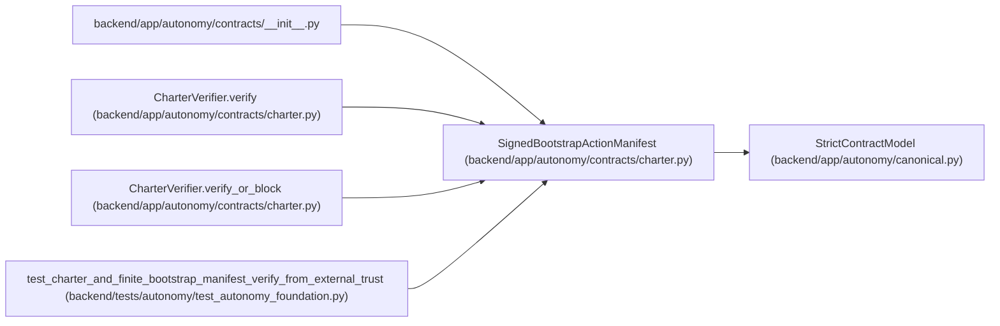

# SignedBootstrapActionManifest

**Location:** `backend/app/autonomy/contracts/charter.py:304`
**Kind:** Pydantic model
**Bases:** `StrictContractModel`
**Module:** [charter](../modules/charter.md)

## Description

_Auto-generated from `SignedBootstrapActionManifest` in `backend/app/autonomy/contracts/charter.py`._

## Attributes

| Name | Type | Wire name | Required | Nullable | Default | Constraints | Examples | Description |
|------|------|-----------|----------|----------|---------|-------------|-------------|----------|
| `document` | `BootstrapActionManifest` | `document` | Yes | No | — | — | — | — |
| `signature` | `DetachedSignatureEnvelope` | `signature` | Yes | No | — | — | — | — |

## Methods

*No public methods. Inherits from base classes.*

## Relationships

<!-- Auto-generated relationship summary. Do not edit by hand. -->

### Summary

| Module | Methods | Attributes |
|---|---:|---|
| [charter](../modules/charter.md) | 0 | `document`, `signature` |

### Structure

| Kind | Entity | Module |
|---|---|---|
| Base | `StrictContractModel` | [autonomy_canonical](../modules/autonomy_canonical.md) |

### References

| Reference | Kind | Source | Call sites |
|---|---|---|---:|
| `__init__` | import | [contracts___init__](../modules/contracts___init__.md) | — |
| `CharterVerifier.verify` | type_reference | [charter](../modules/charter.md) | — |
| `CharterVerifier.verify_or_block` | type_reference | [charter](../modules/charter.md) | — |
| `test_charter_and_finite_bootstrap_manifest_verify_from_external_trust` | call | [test_autonomy_foundation](../modules/test_autonomy_foundation.md) | 1 |
