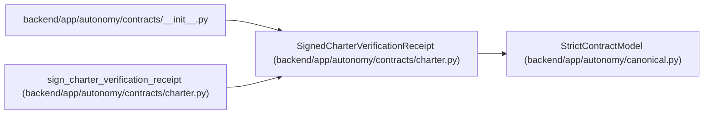

# SignedCharterVerificationReceipt

**Location:** `backend/app/autonomy/contracts/charter.py:357`
**Kind:** Pydantic model
**Bases:** `StrictContractModel`
**Module:** [charter](../modules/charter.md)

## Description

_Auto-generated from `SignedCharterVerificationReceipt` in `backend/app/autonomy/contracts/charter.py`._

## Attributes

| Name | Type | Wire name | Required | Nullable | Default | Constraints | Examples | Description |
|------|------|-----------|----------|----------|---------|-------------|-------------|----------|
| `receipt` | `CharterVerificationReceipt` | `receipt` | Yes | No | — | — | — | — |
| `signature` | `DetachedSignatureEnvelope` | `signature` | Yes | No | — | — | — | — |

## Methods

*No public methods. Inherits from base classes.*

## Relationships

<!-- Auto-generated relationship summary. Do not edit by hand. -->

### Summary

| Module | Methods | Attributes |
|---|---:|---|
| [charter](../modules/charter.md) | 0 | `receipt`, `signature` |

### Structure

| Kind | Entity | Module |
|---|---|---|
| Base | `StrictContractModel` | [autonomy_canonical](../modules/autonomy_canonical.md) |

### References

| Reference | Kind | Source | Call sites |
|---|---|---|---:|
| `__init__` | import | [contracts___init__](../modules/contracts___init__.md) | — |
| `sign_charter_verification_receipt` | call | [charter](../modules/charter.md) | 1 |
| `sign_charter_verification_receipt` | type_reference | [charter](../modules/charter.md) | — |
