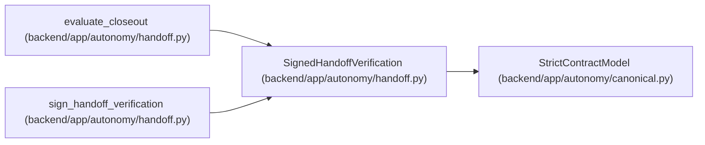

# SignedHandoffVerification

**Location:** `backend/app/autonomy/handoff.py:161`
**Kind:** Pydantic model
**Bases:** `StrictContractModel`
**Module:** [handoff](../modules/handoff.md)

## Description

_Auto-generated from `SignedHandoffVerification` in `backend/app/autonomy/handoff.py`._

## Attributes

| Name | Type | Wire name | Required | Nullable | Default | Constraints | Examples | Description |
|------|------|-----------|----------|----------|---------|-------------|-------------|----------|
| `verification` | `HandoffVerification` | `verification` | Yes | No | — | — | — | — |
| `signature` | `DetachedSignatureEnvelope` | `signature` | Yes | No | — | — | — | — |

## Methods

*No public methods. Inherits from base classes.*

## Relationships

<!-- Auto-generated relationship summary. Do not edit by hand. -->

### Summary

| Module | Methods | Attributes |
|---|---:|---|
| [handoff](../modules/handoff.md) | 0 | `signature`, `verification` |

### Structure

| Kind | Entity | Module |
|---|---|---|
| Base | `StrictContractModel` | [autonomy_canonical](../modules/autonomy_canonical.md) |

### References

| Reference | Kind | Source | Call sites |
|---|---|---|---:|
| `evaluate_closeout` | type_reference | [handoff](../modules/handoff.md) | — |
| `sign_handoff_verification` | call | [handoff](../modules/handoff.md) | 1 |
| `sign_handoff_verification` | type_reference | [handoff](../modules/handoff.md) | — |
