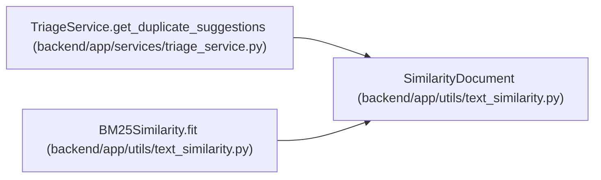

# SimilarityDocument

**Location:** `backend/app/utils/text_similarity.py:25`
**Kind:** Class
**Bases:** —
**Module:** [text_similarity](../modules/text_similarity.md)

**Decorators:** `@dataclass(frozen=True)`

## Description

Document used by the BM25 similarity scorer.

## Attributes

| Name | Type | Default | Description |
|------|------|---------|-------------|
| `key` | `str` | *required* | — |
| `text` | `str` | *required* | — |

## Methods

*No public methods. Inherits from base classes.*

## Relationships

<!-- Auto-generated relationship summary. Do not edit by hand. -->

### Summary

| Module | Methods | Attributes |
|---|---:|---|
| [text_similarity](../modules/text_similarity.md) | 0 | `key`, `text` |

### References

| Reference | Kind | Source | Call sites |
|---|---|---|---:|
| `TriageService.get_duplicate_suggestions` | call | [triage_service](../modules/triage_service.md) | 2 |
| `BM25Similarity.fit` | type_reference | [text_similarity](../modules/text_similarity.md) | — |
