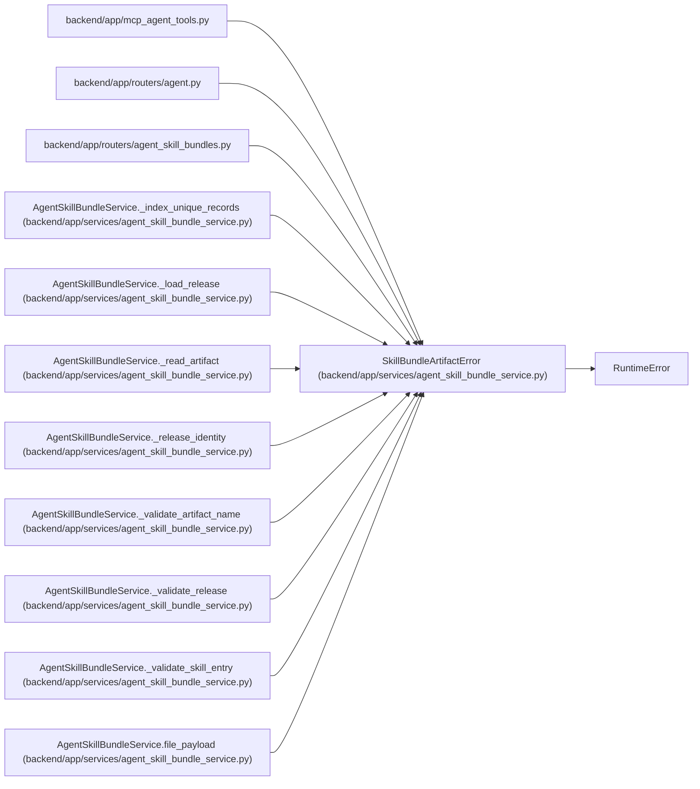

# SkillBundleArtifactError

**Location:** `backend/app/services/agent_skill_bundle_service.py:44`
**Kind:** Class
**Bases:** `RuntimeError`
**Module:** [agent_skill_bundle_service](../modules/agent_skill_bundle_service.md)

## Description

Raised when deployed build artifacts fail their integrity contract.

## Attributes

*No annotated attributes found.*

## Methods

*No public methods. Inherits from base classes.*

## Relationships

<!-- Auto-generated relationship summary. Do not edit by hand. -->

### Summary

| Module | Methods | Attributes |
|---|---:|---|
| [agent_skill_bundle_service](../modules/agent_skill_bundle_service.md) | 0 | — |

### Structure

| Kind | Entity | Module |
|---|---|---|
| Base | `RuntimeError` | — |

### References

| Reference | Kind | Source | Call sites |
|---|---|---|---:|
| `mcp_agent_tools` | import | [mcp_agent_tools](../modules/mcp_agent_tools.md) | — |
| `agent` | import | [routers_agent](../modules/routers_agent.md) | — |
| `agent_skill_bundles` | import | [agent_skill_bundles](../modules/agent_skill_bundles.md) | — |
| `AgentSkillBundleService._index_unique_records` | call | [agent_skill_bundle_service](../modules/agent_skill_bundle_service.md) | 1 |
| `AgentSkillBundleService._load_release` | call | [agent_skill_bundle_service](../modules/agent_skill_bundle_service.md) | 1 |
| `AgentSkillBundleService._read_artifact` | call | [agent_skill_bundle_service](../modules/agent_skill_bundle_service.md) | 7 |
| `AgentSkillBundleService._release_identity` | call | [agent_skill_bundle_service](../modules/agent_skill_bundle_service.md) | 6 |
| `AgentSkillBundleService._validate_artifact_name` | call | [agent_skill_bundle_service](../modules/agent_skill_bundle_service.md) | 1 |
| `AgentSkillBundleService._validate_release` | call | [agent_skill_bundle_service](../modules/agent_skill_bundle_service.md) | 16 |
| `AgentSkillBundleService._validate_skill_entry` | call | [agent_skill_bundle_service](../modules/agent_skill_bundle_service.md) | 11 |
| `AgentSkillBundleService.file_payload` | call | [agent_skill_bundle_service](../modules/agent_skill_bundle_service.md) | 5 |
