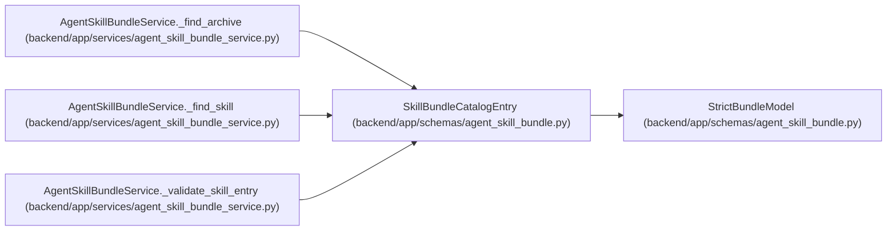

# SkillBundleCatalogEntry

**Location:** `backend/app/schemas/agent_skill_bundle.py:36`
**Kind:** Pydantic model
**Bases:** `StrictBundleModel`
**Module:** [agent_skill_bundle](../modules/agent_skill_bundle.md)

## Description

Versioned compatibility and integrity manifest for one role skill.

## Attributes

| Name | Type | Wire name | Required | Nullable | Default | Constraints | Examples | Description |
|------|------|-----------|----------|----------|---------|-------------|-------------|----------|
| `name` | `str` | `name` | Yes | No | — | pattern='^[a-z0-9]+(?:-[a-z0-9]+)*$' | — | — |
| `role` | `Literal['pm', 'worker']` | `role` | Yes | No | — | — | — | — |
| `version` | `str` | `version` | Yes | No | — | pattern='^\\d+\\.\\d+\\.\\d+$' | — | — |
| `path` | `str` | `path` | Yes | No | — | min_length=1 | — | — |
| `entrypoint` | `Literal['SKILL.md']` | `entrypoint` | Yes | No | — | — | — | — |
| `license` | `str` | `license` | Yes | No | — | min_length=1 | — | — |
| `api_contract` | `str` | `api_contract` | Yes | No | — | min_length=1 | — | — |
| `server_compatibility` | `str` | `server_compatibility` | Yes | No | — | min_length=1 | — | — |
| `required_features` | `list[str]` | `required_features` | Yes | No | — | — | — | — |
| `required_scopes` | `list[str]` | `required_scopes` | Yes | No | — | — | — | — |
| `optional_scopes` | `list[str]` | `optional_scopes` | Yes | No | — | — | — | — |
| `files` | `list[SkillBundleFileRecord]` | `files` | Yes | No | — | — | — | — |
| `archives` | `list[SkillBundleArchiveRecord]` | `archives` | Yes | No | — | — | — | — |

## Methods

*No public methods. Inherits from base classes.*

## Relationships

<!-- Auto-generated relationship summary. Do not edit by hand. -->

### Summary

| Module | Methods | Attributes |
|---|---:|---|
| [agent_skill_bundle](../modules/agent_skill_bundle.md) | 0 | `api_contract`, `archives`, `entrypoint`, `files`, `license`, `name`, `optional_scopes`, `path`, `required_features`, `required_scopes`, `role`, `server_compatibility` |

### Structure

| Kind | Entity | Module |
|---|---|---|
| Base | `StrictBundleModel` | [agent_skill_bundle](../modules/agent_skill_bundle.md) |

### References

| Reference | Kind | Source | Call sites |
|---|---|---|---:|
| `AgentSkillBundleService._find_archive` | type_reference | [agent_skill_bundle_service](../modules/agent_skill_bundle_service.md) | — |
| `AgentSkillBundleService._find_skill` | type_reference | [agent_skill_bundle_service](../modules/agent_skill_bundle_service.md) | — |
| `AgentSkillBundleService._validate_skill_entry` | type_reference | [agent_skill_bundle_service](../modules/agent_skill_bundle_service.md) | — |
