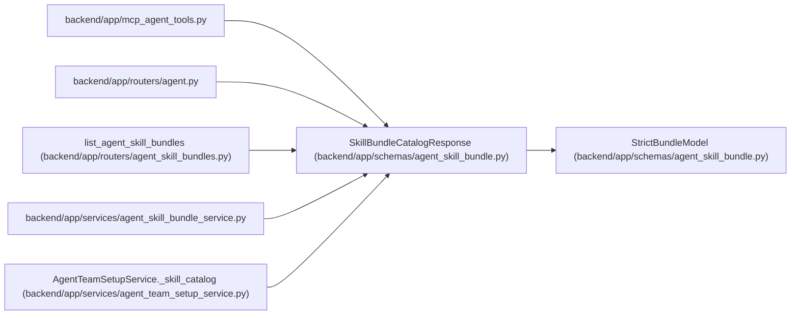

# SkillBundleCatalogResponse

**Location:** `backend/app/schemas/agent_skill_bundle.py:54`
**Kind:** Pydantic model
**Bases:** `StrictBundleModel`
**Module:** [agent_skill_bundle](../modules/agent_skill_bundle.md)

## Description

Canonical catalog emitted by the deterministic skill build.

## Attributes

| Name | Type | Wire name | Required | Nullable | Default | Constraints | Examples | Description |
|------|------|-----------|----------|----------|---------|-------------|-------------|----------|
| `schema_version` | `Literal['workchord-agent-skills/v1']` | `schema_version` | Yes | No | — | — | — | — |
| `catalog_version` | `str` | `catalog_version` | Yes | No | — | pattern='^\\d+\\.\\d+\\.\\d+$' | — | — |
| `source_revision` | `str` | `source_revision` | Yes | No | — | pattern=unknown (SOURCE_REVISION_PATTERN) | — | — |
| `api_contract` | `str` | `api_contract` | Yes | No | — | min_length=1 | — | — |
| `skills` | `list[SkillBundleCatalogEntry]` | `skills` | Yes | No | — | — | — | — |

## Methods

*No public methods. Inherits from base classes.*

## Relationships

<!-- Auto-generated relationship summary. Do not edit by hand. -->

### Summary

| Module | Methods | Attributes |
|---|---:|---|
| [agent_skill_bundle](../modules/agent_skill_bundle.md) | 0 | `api_contract`, `catalog_version`, `schema_version`, `skills`, `source_revision` |

### Structure

| Kind | Entity | Module |
|---|---|---|
| Base | `StrictBundleModel` | [agent_skill_bundle](../modules/agent_skill_bundle.md) |

### References

| Reference | Kind | Source | Call sites |
|---|---|---|---:|
| `mcp_agent_tools` | import | [mcp_agent_tools](../modules/mcp_agent_tools.md) | — |
| `agent` | import | [routers_agent](../modules/routers_agent.md) | — |
| `list_agent_skill_bundles` | type_reference | [agent_skill_bundles](../modules/agent_skill_bundles.md) | — |
| `agent_skill_bundle_service` | import | [agent_skill_bundle_service](../modules/agent_skill_bundle_service.md) | — |
| `AgentTeamSetupService._skill_catalog` | type_reference | [agent_team_setup_service](../modules/agent_team_setup_service.md) | — |
