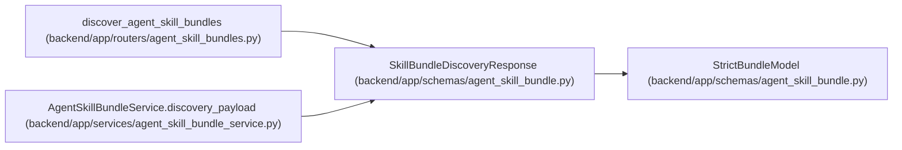

# SkillBundleDiscoveryResponse

**Location:** `backend/app/schemas/agent_skill_bundle.py:88`
**Kind:** Pydantic model
**Bases:** `StrictBundleModel`
**Module:** [agent_skill_bundle](../modules/agent_skill_bundle.md)

## Description

Stable well-known pointer to the mutable catalog URL.

## Attributes

| Name | Type | Wire name | Required | Nullable | Default | Constraints | Examples | Description |
|------|------|-----------|----------|----------|---------|-------------|-------------|----------|
| `schema_version` | `Literal['workchord-agent-skills-discovery/v1']` | `schema_version` | Yes | No | — | — | — | — |
| `catalog_url` | `str` | `catalog_url` | Yes | No | — | — | — | — |
| `catalog_version` | `str` | `catalog_version` | Yes | No | — | — | — | — |
| `source_revision` | `str` | `source_revision` | Yes | No | — | — | — | — |
| `api_contract` | `str` | `api_contract` | Yes | No | — | — | — | — |

## Methods

*No public methods. Inherits from base classes.*

## Relationships

<!-- Auto-generated relationship summary. Do not edit by hand. -->

### Summary

| Module | Methods | Attributes |
|---|---:|---|
| [agent_skill_bundle](../modules/agent_skill_bundle.md) | 0 | `api_contract`, `catalog_url`, `catalog_version`, `schema_version`, `source_revision` |

### Structure

| Kind | Entity | Module |
|---|---|---|
| Base | `StrictBundleModel` | [agent_skill_bundle](../modules/agent_skill_bundle.md) |

### References

| Reference | Kind | Source | Call sites |
|---|---|---|---:|
| `discover_agent_skill_bundles` | type_reference | [agent_skill_bundles](../modules/agent_skill_bundles.md) | — |
| `AgentSkillBundleService.discovery_payload` | call | [agent_skill_bundle_service](../modules/agent_skill_bundle_service.md) | 1 |
