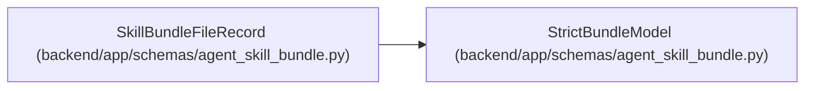

# SkillBundleFileRecord

**Location:** `backend/app/schemas/agent_skill_bundle.py:19`
**Kind:** Pydantic model
**Bases:** `StrictBundleModel`
**Module:** [agent_skill_bundle](../modules/agent_skill_bundle.md)

## Description

One allow-listed file in an independently installable role skill.

## Attributes

| Name | Type | Wire name | Required | Nullable | Default | Constraints | Examples | Description |
|------|------|-----------|----------|----------|---------|-------------|-------------|----------|
| `path` | `str` | `path` | Yes | No | — | min_length=1 | — | — |
| `sha256` | `str` | `sha256` | Yes | No | — | pattern=unknown (SHA256_PATTERN) | — | — |
| `size` | `int` | `size` | Yes | No | — | ge=0 | — | — |

## Methods

*No public methods. Inherits from base classes.*

## Relationships

<!-- Auto-generated relationship summary. Do not edit by hand. -->

### Summary

| Module | Methods | Attributes |
|---|---:|---|
| [agent_skill_bundle](../modules/agent_skill_bundle.md) | 0 | `path`, `sha256`, `size` |

### Structure

| Kind | Entity | Module |
|---|---|---|
| Base | `StrictBundleModel` | [agent_skill_bundle](../modules/agent_skill_bundle.md) |
