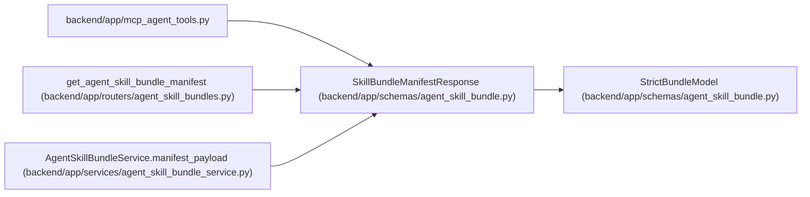

# SkillBundleManifestResponse

**Location:** `backend/app/schemas/agent_skill_bundle.py:80`
**Kind:** Pydantic model
**Bases:** `StrictBundleModel`
**Module:** [agent_skill_bundle](../modules/agent_skill_bundle.md)

## Description

Exact-version manifest projected from the canonical catalog.

## Attributes

| Name | Type | Wire name | Required | Nullable | Default | Constraints | Examples | Description |
|------|------|-----------|----------|----------|---------|-------------|-------------|----------|
| `schema_version` | `Literal['workchord-agent-skill-manifest/v1']` | `schema_version` | Yes | No | — | — | — | — |
| `entry_revision` | `str` | `entry_revision` | Yes | No | — | pattern=unknown (SOURCE_REVISION_PATTERN) | — | — |
| `skill` | `SkillBundleCatalogEntry` | `skill` | Yes | No | — | — | — | — |

## Methods

*No public methods. Inherits from base classes.*

## Relationships

<!-- Auto-generated relationship summary. Do not edit by hand. -->

### Summary

| Module | Methods | Attributes |
|---|---:|---|
| [agent_skill_bundle](../modules/agent_skill_bundle.md) | 0 | `entry_revision`, `schema_version`, `skill` |

### Structure

| Kind | Entity | Module |
|---|---|---|
| Base | `StrictBundleModel` | [agent_skill_bundle](../modules/agent_skill_bundle.md) |

### References

| Reference | Kind | Source | Call sites |
|---|---|---|---:|
| `mcp_agent_tools` | import | [mcp_agent_tools](../modules/mcp_agent_tools.md) | — |
| `get_agent_skill_bundle_manifest` | type_reference | [agent_skill_bundles](../modules/agent_skill_bundles.md) | — |
| `AgentSkillBundleService.manifest_payload` | call | [agent_skill_bundle_service](../modules/agent_skill_bundle_service.md) | 1 |
