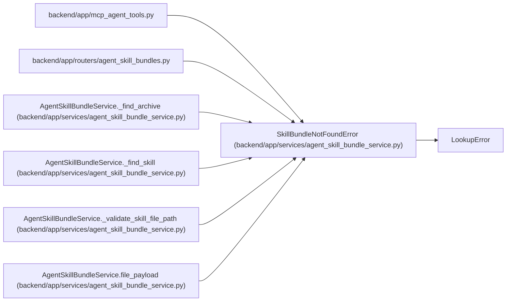

# SkillBundleNotFoundError

**Location:** `backend/app/services/agent_skill_bundle_service.py:40`
**Kind:** Class
**Bases:** `LookupError`
**Module:** [agent_skill_bundle_service](../modules/agent_skill_bundle_service.md)

## Description

Raised when a requested exact skill, version, format, or file is absent.

## Attributes

*No annotated attributes found.*

## Methods

*No public methods. Inherits from base classes.*

## Relationships

<!-- Auto-generated relationship summary. Do not edit by hand. -->

### Summary

| Module | Methods | Attributes |
|---|---:|---|
| [agent_skill_bundle_service](../modules/agent_skill_bundle_service.md) | 0 | — |

### Structure

| Kind | Entity | Module |
|---|---|---|
| Base | `LookupError` | — |

### References

| Reference | Kind | Source | Call sites |
|---|---|---|---:|
| `mcp_agent_tools` | import | [mcp_agent_tools](../modules/mcp_agent_tools.md) | — |
| `agent_skill_bundles` | import | [agent_skill_bundles](../modules/agent_skill_bundles.md) | — |
| `AgentSkillBundleService._find_archive` | call | [agent_skill_bundle_service](../modules/agent_skill_bundle_service.md) | 1 |
| `AgentSkillBundleService._find_skill` | call | [agent_skill_bundle_service](../modules/agent_skill_bundle_service.md) | 1 |
| `AgentSkillBundleService._validate_skill_file_path` | call | [agent_skill_bundle_service](../modules/agent_skill_bundle_service.md) | 1 |
| `AgentSkillBundleService.file_payload` | call | [agent_skill_bundle_service](../modules/agent_skill_bundle_service.md) | 1 |
