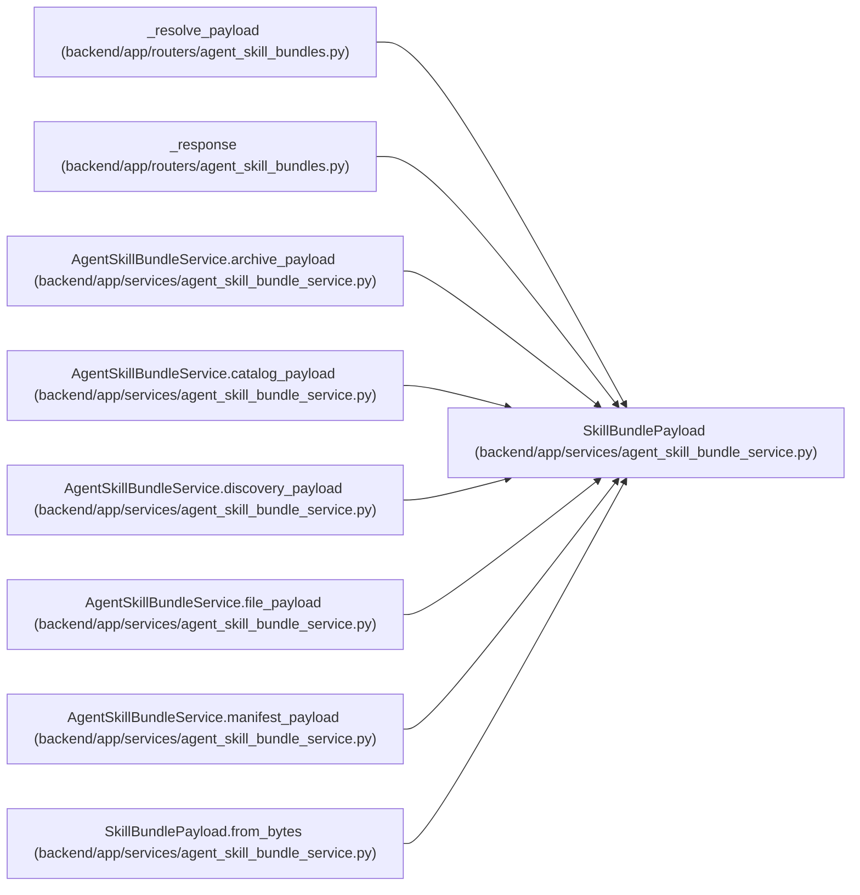

# SkillBundlePayload

**Location:** `backend/app/services/agent_skill_bundle_service.py:49`
**Kind:** Class
**Bases:** —
**Module:** [agent_skill_bundle_service](../modules/agent_skill_bundle_service.md)

**Decorators:** `@dataclass(frozen=True)`

## Description

Exact response bytes and their transport integrity metadata.

## Attributes

| Name | Type | Default | Description |
|------|------|---------|-------------|
| `content` | `bytes` | *required* | — |
| `media_type` | `str` | *required* | — |
| `etag` | `str` | *required* | — |
| `content_digest` | `str` | *required* | — |
| `cache_control` | `str` | *required* | — |
| `filename` | `str \| None` | `None` | — |

## Methods

| Method | Signature | Decorators | Description |
|--------|-----------|------------|-------------|
| `from_bytes` | `(content: bytes, *, media_type: str, cache_control: str, filename: str \| None = None) -> 'SkillBundlePayload'` | `@classmethod` | — |

## Relationships

<!-- Auto-generated relationship summary. Do not edit by hand. -->

### Summary

| Module | Methods | Attributes |
|---|---:|---|
| [agent_skill_bundle_service](../modules/agent_skill_bundle_service.md) | 1 | `cache_control`, `content`, `content_digest`, `etag`, `filename`, `media_type` |

### References

| Reference | Kind | Source | Call sites |
|---|---|---|---:|
| `_resolve_payload` | type_reference | [agent_skill_bundles](../modules/agent_skill_bundles.md) | — |
| `_response` | type_reference | [agent_skill_bundles](../modules/agent_skill_bundles.md) | — |
| `AgentSkillBundleService.archive_payload` | type_reference | [agent_skill_bundle_service](../modules/agent_skill_bundle_service.md) | — |
| `AgentSkillBundleService.catalog_payload` | type_reference | [agent_skill_bundle_service](../modules/agent_skill_bundle_service.md) | — |
| `AgentSkillBundleService.discovery_payload` | type_reference | [agent_skill_bundle_service](../modules/agent_skill_bundle_service.md) | — |
| `AgentSkillBundleService.file_payload` | type_reference | [agent_skill_bundle_service](../modules/agent_skill_bundle_service.md) | — |
| `AgentSkillBundleService.manifest_payload` | type_reference | [agent_skill_bundle_service](../modules/agent_skill_bundle_service.md) | — |
| `SkillBundlePayload.from_bytes` | call | [agent_skill_bundle_service](../modules/agent_skill_bundle_service.md) | 1 |
| `SkillBundlePayload.from_bytes` | type_reference | [agent_skill_bundle_service](../modules/agent_skill_bundle_service.md) | — |
