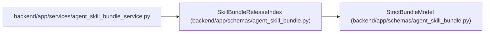

# SkillBundleReleaseIndex

**Location:** `backend/app/schemas/agent_skill_bundle.py:72`
**Kind:** Pydantic model
**Bases:** `StrictBundleModel`
**Module:** [agent_skill_bundle](../modules/agent_skill_bundle.md)

## Description

Checksum index emitted beside the catalog and role archives.

## Attributes

| Name | Type | Wire name | Required | Nullable | Default | Constraints | Examples | Description |
|------|------|-----------|----------|----------|---------|-------------|-------------|----------|
| `schema_version` | `Literal['workchord-agent-skills-release/v1']` | `schema_version` | Yes | No | — | — | — | — |
| `catalog` | `SkillBundleReleaseArtifact` | `catalog` | Yes | No | — | — | — | — |
| `artifacts` | `list[SkillBundleReleaseArtifact]` | `artifacts` | Yes | No | — | — | — | — |

## Methods

*No public methods. Inherits from base classes.*

## Relationships

<!-- Auto-generated relationship summary. Do not edit by hand. -->

### Summary

| Module | Methods | Attributes |
|---|---:|---|
| [agent_skill_bundle](../modules/agent_skill_bundle.md) | 0 | `artifacts`, `catalog`, `schema_version` |

### Structure

| Kind | Entity | Module |
|---|---|---|
| Base | `StrictBundleModel` | [agent_skill_bundle](../modules/agent_skill_bundle.md) |

### References

| Reference | Kind | Source | Call sites |
|---|---|---|---:|
| `agent_skill_bundle_service` | import | [agent_skill_bundle_service](../modules/agent_skill_bundle_service.md) | — |
