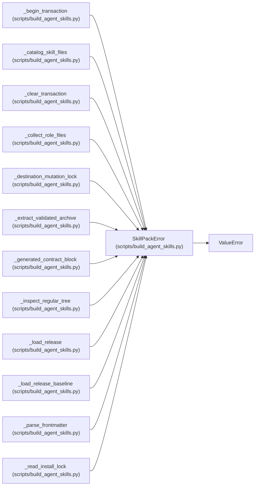

# SkillPackError

**Location:** `scripts/build_agent_skills.py:810`
**Kind:** Class
**Bases:** `ValueError`
**Module:** [build_agent_skills](../modules/build_agent_skills.md)

## Description

Raised when skill source, catalog, or archive validation fails.

## Attributes

*No annotated attributes found.*

## Methods

*No public methods. Inherits from base classes.*

## Relationships

<!-- Auto-generated relationship summary. Do not edit by hand. -->

### Summary

| Module | Methods | Attributes |
|---|---:|---|
| [build_agent_skills](../modules/build_agent_skills.md) | 0 | — |

### Structure

| Kind | Entity | Module |
|---|---|---|
| Base | `ValueError` | — |

### References

| Reference | Kind | Source | Call sites |
|---|---|---|---:|
| `_begin_transaction` | call | [build_agent_skills](../modules/build_agent_skills.md) | 1 |
| `_catalog_skill_files` | call | [build_agent_skills](../modules/build_agent_skills.md) | 4 |
| `_clear_transaction` | call | [build_agent_skills](../modules/build_agent_skills.md) | 1 |
| `_collect_role_files` | call | [build_agent_skills](../modules/build_agent_skills.md) | 6 |
| `_destination_mutation_lock` | call | [build_agent_skills](../modules/build_agent_skills.md) | 8 |
| `_extract_validated_archive` | call | [build_agent_skills](../modules/build_agent_skills.md) | 4 |
| `_generated_contract_block` | call | [build_agent_skills](../modules/build_agent_skills.md) | 2 |
| `_inspect_regular_tree` | call | [build_agent_skills](../modules/build_agent_skills.md) | 3 |
| `_load_release` | call | [build_agent_skills](../modules/build_agent_skills.md) | 9 |
| `_load_release_baseline` | call | [build_agent_skills](../modules/build_agent_skills.md) | 13 |
| `_parse_frontmatter` | call | [build_agent_skills](../modules/build_agent_skills.md) | 10 |
| `_read_install_lock` | call | [build_agent_skills](../modules/build_agent_skills.md) | 9 |

> References: showing 12 of 52 logical references; 40 omitted by the 12-row generated summary limit.
