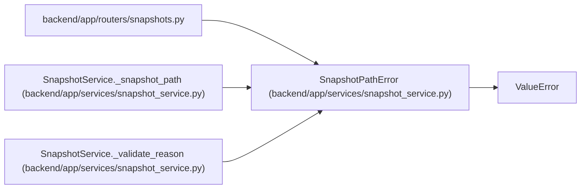

# SnapshotPathError

**Location:** `backend/app/services/snapshot_service.py:22`
**Kind:** Class
**Bases:** `ValueError`
**Module:** [snapshot_service](../modules/snapshot_service.md)

## Description

Raised when a snapshot name cannot be safely resolved inside its iteration directory.

## Attributes

*No annotated attributes found.*

## Methods

*No public methods. Inherits from base classes.*

## Relationships

<!-- Auto-generated relationship summary. Do not edit by hand. -->

### Summary

| Module | Methods | Attributes |
|---|---:|---|
| [snapshot_service](../modules/snapshot_service.md) | 0 | — |

### Structure

| Kind | Entity | Module |
|---|---|---|
| Base | `ValueError` | — |

### References

| Reference | Kind | Source | Call sites |
|---|---|---|---:|
| `snapshots` | import | [snapshots](../modules/snapshots.md) | — |
| `SnapshotService._snapshot_path` | call | [snapshot_service](../modules/snapshot_service.md) | 4 |
| `SnapshotService._validate_reason` | call | [snapshot_service](../modules/snapshot_service.md) | 1 |
