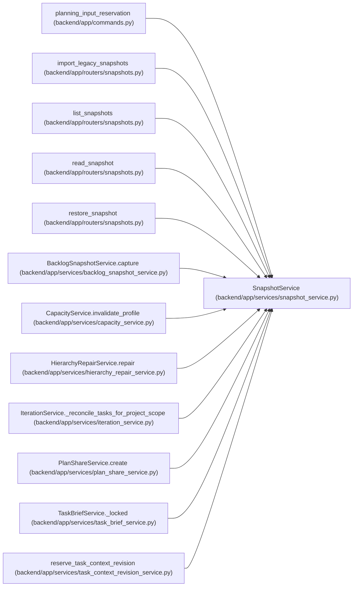

# SnapshotService

**Location:** `backend/app/services/snapshot_service.py:31`
**Kind:** Class
**Bases:** —
**Module:** [snapshot_service](../modules/snapshot_service.md)

## Description

Service for creating and managing iteration snapshots.

Stores bounded, checksummed pre-command points transactionally in the database; preview and failed commands cannot publish or evict them. Captured project scopes gate payload reads. Restore preserves supported IDs, recovers captured iteration dates and absences, records baseline restoration, and invalidates current acceptance. Ambiguous legacy files remain quarantined provenance records. Global configuration and external side effects require separate recovery.

Scheduled and backlog restoration share a version allocator under the owning scope lock. It advances above the saved version, live task, retained history and durable deletion fence. Current progress and acceptance are cleared; immutable history survives. A deleted task without a reliable deletion fence returns snapshot_version_history_unknown (409), requiring recovery from a complete matching database backup.

## Attributes

*No annotated attributes found.*

## Methods

| Method | Signature | Decorators | Description |
|--------|-----------|------------|-------------|
| `__init__` | `(db: AsyncSession)` | — | — |
| `_preflight_allocation_membership` | *(async)* `(iteration_id, payload, current)` | — | Inventory complete allocation references before changing recovery state. |
| `_get_snapshot_dir` | `(iteration_id: int) -> Path` | — | Get the snapshot directory for an iteration. |
| `_validate_reason` | `(reason: str) -> str` | — | Return a filename-safe snapshot reason or reject the caller value. |
| `_snapshot_path` | `(iteration_id: int, filename: str, *, reject_symlink: bool = True) -> Path` | — | Resolve a generated basename beneath the iteration snapshot directory. |
| `_snapshot_files` | `(iteration_id: int) -> list[Path]` | — | Return validated generated snapshot files without following unsafe links. |
| `build_snapshot_data` | *(async)* `(iteration_id: int, reason: str = 'auto') -> dict \| None` | — | Build one JSON-native immutable representation of an iteration. |
| `create_snapshot` | *(async)* `(iteration_id: int, reason: str = 'auto') -> str \| None` | `@atomic_command` | Persist one pre-command recovery point and retention in the owner's transaction. |
| `_encode` | `(payload: dict) -> bytes` | `@staticmethod` | — |
| `rotate_snapshots` | *(async)* `(iteration_id: int, max_count: int \| None = None) -> int` | `@atomic_command` | — |
| `list_snapshots` | *(async)* `(iteration_id: int) -> list[dict]` | — | — |
| `get_snapshot` | *(async)* `(iteration_id: int, filename: str) -> dict \| None` | — | — |
| `_payload_visible` | `(payload)` | — | Historical JSON must not bypass current project visibility through an unscoped iteration. |
| `import_legacy` | *(async)* `(iteration_id: int, *, dry_run = True, limit = 25) -> list[dict]` | `@atomic_command` | Inventory legacy files without inventing trust for ambiguous preview-era content. |
| `restore` | *(async)* `(iteration_id: int, filename: str, *, expected_revision = None) -> dict` | `@atomic_command` | Restore supported IDs in place, retain history and invalidate current execution acceptance. |
| `_task_to_export` | `(task) -> dict` | — | Convert task to export format recursively. |
| `_member_to_export` | `(member) -> dict` | — | Convert team member to export format. |

## Relationships

<!-- Auto-generated relationship summary. Do not edit by hand. -->

### Summary

| Module | Methods | Attributes |
|---|---:|---|
| [snapshot_service](../modules/snapshot_service.md) | 17 | — |

### References

| Reference | Kind | Source | Call sites |
|---|---|---|---:|
| `planning_input_reservation` | call | [commands](../modules/commands.md) | 1 |
| `import_legacy_snapshots` | call | [snapshots](../modules/snapshots.md) | 1 |
| `list_snapshots` | call | [snapshots](../modules/snapshots.md) | 1 |
| `read_snapshot` | call | [snapshots](../modules/snapshots.md) | 1 |
| `restore_snapshot` | call | [snapshots](../modules/snapshots.md) | 1 |
| `BacklogSnapshotService.capture` | call | [backlog_snapshot_service](../modules/backlog_snapshot_service.md) | 1 |
| `CapacityService.invalidate_profile` | call | [capacity_service](../modules/capacity_service.md) | 1 |
| `HierarchyRepairService.repair` | call | [hierarchy_repair_service](../modules/hierarchy_repair_service.md) | 1 |
| `IterationService._reconcile_tasks_for_project_scope` | call | [iteration_service](../modules/iteration_service.md) | 1 |
| `PlanShareService.create` | call | [plan_share_service](../modules/plan_share_service.md) | 1 |
| `TaskBriefService._locked` | call | [task_brief_service](../modules/task_brief_service.md) | 1 |
| `reserve_task_context_revision` | call | [task_context_revision_service](../modules/task_context_revision_service.md) | 1 |

> References: showing 12 of 44 logical references; 32 omitted by the 12-row generated summary limit.
