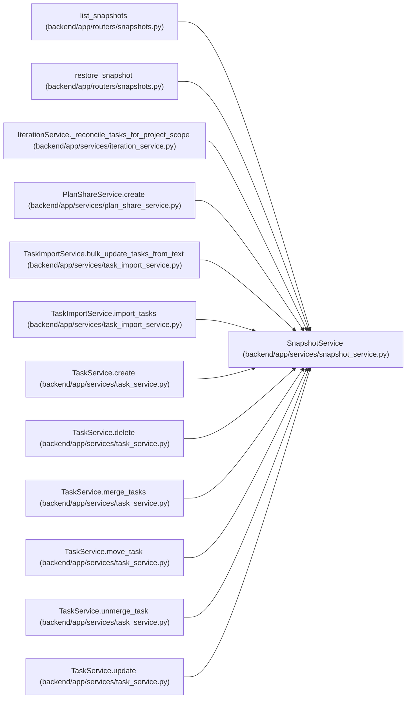

# SnapshotService

**Location:** `backend/app/services/snapshot_service.py:26`
**Kind:** Class
**Bases:** —
**Module:** [snapshot_service](../modules/snapshot_service.md)

## Description

Service for creating and managing iteration snapshots.

## Attributes

*No annotated attributes found.*

## Methods

| Method | Signature | Decorators | Description |
|--------|-----------|------------|-------------|
| `__init__` | `(db: AsyncSession)` | — | — |
| `_get_snapshot_dir` | `(iteration_id: int) -> Path` | — | Get the snapshot directory for an iteration. |
| `_validate_reason` | `(reason: str) -> str` | — | Return a filename-safe snapshot reason or reject the caller value. |
| `_snapshot_path` | `(iteration_id: int, filename: str, *, reject_symlink: bool = True) -> Path` | — | Resolve a generated basename beneath the iteration snapshot directory. |
| `_snapshot_files` | `(iteration_id: int) -> list[Path]` | — | Return validated generated snapshot files without following unsafe links. |
| `build_snapshot_data` | *(async)* `(iteration_id: int, reason: str = 'auto') -> dict \| None` | — | Build one JSON-native immutable representation of an iteration. |
| `create_snapshot` | *(async)* `(iteration_id: int, reason: str = 'auto') -> str \| None` | — | Create a snapshot of the iteration's current state. |
| `rotate_snapshots` | *(async)* `(iteration_id: int, max_count: int = 10) -> int` | — | Remove oldest snapshots if count exceeds max. |
| `list_snapshots` | `(iteration_id: int) -> list[dict]` | — | List all snapshots for an iteration. |
| `get_snapshot` | `(iteration_id: int, filename: str) -> dict \| None` | — | Get snapshot data by filename. |
| `_task_to_export` | `(task) -> dict` | — | Convert task to export format recursively. |
| `_member_to_export` | `(member) -> dict` | — | Convert team member to export format. |

## Relationships

<!-- Auto-generated relationship summary. Do not edit by hand. -->

### Summary

| Module | Methods | Attributes |
|---|---:|---|
| [snapshot_service](../modules/snapshot_service.md) | 12 | — |

### References

| Reference | Kind | Source | Call sites |
|---|---|---|---:|
| `list_snapshots` | call | [snapshots](../modules/snapshots.md) | 1 |
| `restore_snapshot` | call | [snapshots](../modules/snapshots.md) | 1 |
| `IterationService._reconcile_tasks_for_project_scope` | call | [iteration_service](../modules/iteration_service.md) | 1 |
| `PlanShareService.create` | call | [plan_share_service](../modules/plan_share_service.md) | 1 |
| `TaskImportService.bulk_update_tasks_from_text` | call | [task_import_service](../modules/task_import_service.md) | 1 |
| `TaskImportService.import_tasks` | call | [task_import_service](../modules/task_import_service.md) | 1 |
| `TaskService.create` | call | [task_service](../modules/task_service.md) | 1 |
| `TaskService.delete` | call | [task_service](../modules/task_service.md) | 1 |
| `TaskService.merge_tasks` | call | [task_service](../modules/task_service.md) | 1 |
| `TaskService.move_task` | call | [task_service](../modules/task_service.md) | 1 |
| `TaskService.unmerge_task` | call | [task_service](../modules/task_service.md) | 1 |
| `TaskService.update` | call | [task_service](../modules/task_service.md) | 1 |
