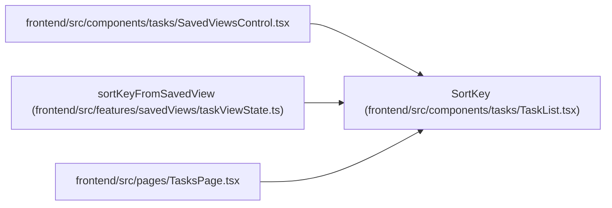

# SortKey

**Location:** `frontend/src/components/tasks/TaskList.tsx:48`
**Kind:** Type alias
**Bases:** —
**Module:** [TaskList](../modules/TaskList.md)

## Description

_Auto-generated from `SortKey` in `frontend/src/components/tasks/TaskList.tsx`._

## Attributes

*No annotated attributes found.*

## Methods

*No public methods. Inherits from base classes.*

## Relationships

<!-- Auto-generated relationship summary. Do not edit by hand. -->

### Summary

| Module | Methods | Attributes |
|---|---:|---|
| [TaskList](../modules/TaskList.md) | 0 | — |

### References

| Reference | Kind | Source | Call sites |
|---|---|---|---:|
| `SavedViewsControl` | import | [SavedViewsControl](../modules/SavedViewsControl.md) | — |
| `sortKeyFromSavedView` | type_reference | [taskViewState](../modules/taskViewState.md) | — |
| `TasksPage` | import | [TasksPage](../modules/TasksPage.md) | — |
