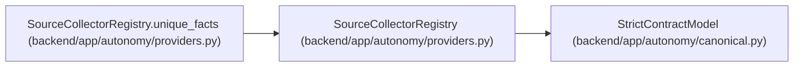

# SourceCollectorRegistry

**Location:** `backend/app/autonomy/providers.py:201`
**Kind:** Pydantic model
**Bases:** `StrictContractModel`
**Module:** [providers](../modules/providers.md)

## Description

_Auto-generated from `SourceCollectorRegistry` in `backend/app/autonomy/providers.py`._

## Validators

| Method | Scope | Fields | Mode | Options |
|--------|-------|--------|------|---------|
| `unique_facts` | model | — | after | — |

## Attributes

| Name | Type | Wire name | Required | Nullable | Default | Constraints | Examples | Description |
|------|------|-----------|----------|----------|---------|-------------|-------------|----------|
| `schema_version` | `Literal['workchord-source-collector-registry-v1']` | `schema_version` | No | No | `'workchord-source-collector-registry-v1'` | — | — | — |
| `registry_revision` | `int` | `registry_revision` | Yes | No | — | ge=1 | — | — |
| `bindings` | `tuple[CollectorBinding, ...]` | `bindings` | Yes | No | — | max_length=2048; min_length=1 | — | — |

## Methods

| Method | Signature | Decorators | Description |
|--------|-----------|------------|-------------|
| `unique_facts` | `() -> 'SourceCollectorRegistry'` | `@model_validator(mode='after')` | — |
| `require` | `(required_fact_kinds: set[str]) -> None` | — | — |

## Relationships

<!-- Auto-generated relationship summary. Do not edit by hand. -->

### Summary

| Module | Methods | Attributes |
|---|---:|---|
| [providers](../modules/providers.md) | 2 | `bindings`, `registry_revision`, `schema_version` |

### Structure

| Kind | Entity | Module |
|---|---|---|
| Base | `StrictContractModel` | [autonomy_canonical](../modules/autonomy_canonical.md) |

### References

| Reference | Kind | Source | Call sites |
|---|---|---|---:|
| `SourceCollectorRegistry.unique_facts` | type_reference | [providers](../modules/providers.md) | — |
