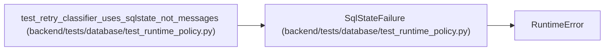

# SqlStateFailure

**Location:** `backend/tests/database/test_runtime_policy.py:23`
**Kind:** Class
**Bases:** `RuntimeError`
**Module:** [test_runtime_policy](../modules/test_runtime_policy.md)

## Description

Minimal Psycopg-shaped fault used without a database server.

## Attributes

*No annotated attributes found.*

## Methods

| Method | Signature | Decorators | Description |
|--------|-----------|------------|-------------|
| `__init__` | `(sqlstate: str)` | — | — |

## Relationships

<!-- Auto-generated relationship summary. Do not edit by hand. -->

### Summary

| Module | Methods | Attributes |
|---|---:|---|
| [test_runtime_policy](../modules/test_runtime_policy.md) | 1 | — |

### Structure

| Kind | Entity | Module |
|---|---|---|
| Base | `RuntimeError` | — |

### References

| Reference | Kind | Source | Call sites |
|---|---|---|---:|
| `test_retry_classifier_uses_sqlstate_not_messages` | call | [test_runtime_policy](../modules/test_runtime_policy.md) | 1 |
