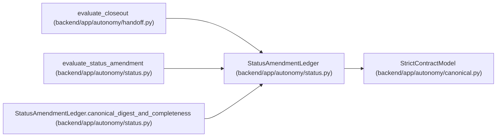

# StatusAmendmentLedger

**Location:** `backend/app/autonomy/status.py:104`
**Kind:** Pydantic model
**Bases:** `StrictContractModel`
**Module:** [status](../modules/status.md)

## Description

_Auto-generated from `StatusAmendmentLedger` in `backend/app/autonomy/status.py`._

## Validators

| Method | Scope | Fields | Mode | Options |
|--------|-------|--------|------|---------|
| `canonical_digest_and_completeness` | model | — | after | — |

## Attributes

| Name | Type | Wire name | Required | Nullable | Default | Constraints | Examples | Description |
|------|------|-----------|----------|----------|---------|-------------|-------------|----------|
| `schema_version` | `Literal['workchord-postgresql-status-amendment-v1']` | `schema_version` | No | No | `'workchord-postgresql-status-amendment-v1'` | — | — | — |
| `generated_at` | `datetime` | `generated_at` | Yes | No | — | — | — | — |
| `evaluator_identity` | `Literal['pg-status-evaluator']` | `evaluator_identity` | No | No | `'pg-status-evaluator'` | — | — | — |
| `contract_manifest_digest` | `str` | `contract_manifest_digest` | Yes | No | — | pattern=unknown (SHA256_PATTERN) | — | — |
| `release_fingerprint` | `str` | `release_fingerprint` | Yes | No | — | pattern=unknown (SHA256_PATTERN) | — | — |
| `charter_digest` | `str` | `charter_digest` | Yes | No | — | pattern=unknown (SHA256_PATTERN) | — | — |
| `source_status_snapshot_digest` | `str` | `source_status_snapshot_digest` | Yes | No | — | pattern=unknown (SHA256_PATTERN) | — | — |
| `waiver_policy` | `Literal['forbidden']` | `waiver_policy` | No | No | `'forbidden'` | — | — | — |
| `tasks` | `tuple[TaskStatusAmendment, ...]` | `tasks` | Yes | No | — | — | — | — |
| `gates` | `tuple[GateStatusAmendment, ...]` | `gates` | Yes | No | — | — | — | — |
| `overall_state` | `Literal['acceptance_pending', 'acceptance_evidenced']` | `overall_state` | Yes | No | — | — | — | — |
| `ledger_digest` | `str` | `ledger_digest` | Yes | No | — | pattern=unknown (SHA256_PATTERN) | — | — |

## Methods

| Method | Signature | Decorators | Description |
|--------|-----------|------------|-------------|
| `canonical_digest_and_completeness` | `() -> 'StatusAmendmentLedger'` | `@model_validator(mode='after')` | — |

## Relationships

<!-- Auto-generated relationship summary. Do not edit by hand. -->

### Summary

| Module | Methods | Attributes |
|---|---:|---|
| [status](../modules/status.md) | 1 | `charter_digest`, `contract_manifest_digest`, `evaluator_identity`, `gates`, `generated_at`, `ledger_digest`, `overall_state`, `release_fingerprint`, `schema_version`, `source_status_snapshot_digest`, `tasks`, `waiver_policy` |

### Structure

| Kind | Entity | Module |
|---|---|---|
| Base | `StrictContractModel` | [autonomy_canonical](../modules/autonomy_canonical.md) |

### References

| Reference | Kind | Source | Call sites |
|---|---|---|---:|
| `evaluate_closeout` | type_reference | [handoff](../modules/handoff.md) | — |
| `evaluate_status_amendment` | call | [status](../modules/status.md) | 1 |
| `evaluate_status_amendment` | type_reference | [status](../modules/status.md) | — |
| `StatusAmendmentLedger.canonical_digest_and_completeness` | type_reference | [status](../modules/status.md) | — |
