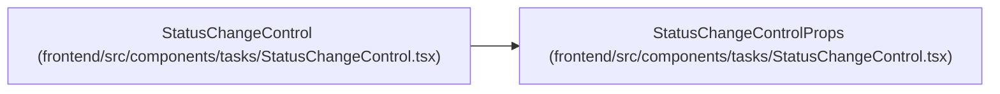

# StatusChangeControlProps

**Location:** `frontend/src/components/tasks/StatusChangeControl.tsx:13`
**Kind:** Class
**Bases:** —
**Module:** [StatusChangeControl](../modules/StatusChangeControl.md)

## Description

_Auto-generated from `StatusChangeControlProps` in `frontend/src/components/tasks/StatusChangeControl.tsx`._

## Attributes

| Name | Type | Default | Description |
|------|------|---------|-------------|
| `task` | `Task` | *required* | — |
| `iterationId` | `number` | *required* | — |
| `onStatusChanged` | `() => void` | *required* | — |
| `onPendingChange` | `(pending: boolean) => void` | *required* | — |

## Methods

*No public methods. Inherits from base classes.*

## Relationships

<!-- Auto-generated relationship summary. Do not edit by hand. -->

### Summary

| Module | Methods | Attributes |
|---|---:|---|
| [StatusChangeControl](../modules/StatusChangeControl.md) | 0 | `iterationId`, `onPendingChange`, `onStatusChanged`, `task` |

### References

| Reference | Kind | Source | Call sites |
|---|---|---|---:|
| `StatusChangeControl` | type_reference | [StatusChangeControl](../modules/StatusChangeControl.md) | — |
