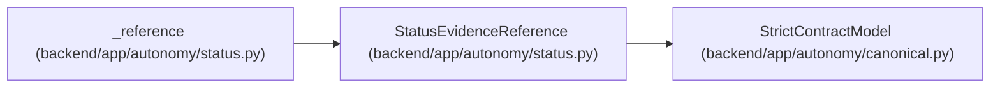

# StatusEvidenceReference

**Location:** `backend/app/autonomy/status.py:72`
**Kind:** Pydantic model
**Bases:** `StrictContractModel`
**Module:** [status](../modules/status.md)

## Description

_Auto-generated from `StatusEvidenceReference` in `backend/app/autonomy/status.py`._

## Attributes

| Name | Type | Wire name | Required | Nullable | Default | Constraints | Examples | Description |
|------|------|-----------|----------|----------|---------|-------------|-------------|----------|
| `evidence_kind` | `str` | `evidence_kind` | Yes | No | — | pattern=unknown (IDENTIFIER_PATTERN) | — | — |
| `immutable_evidence_uri` | `str` | `immutable_evidence_uri` | Yes | No | — | min_length=1; max_length=2048 | — | — |
| `immutable_evidence_checksum` | `str` | `immutable_evidence_checksum` | Yes | No | — | pattern=unknown (SHA256_PATTERN) | — | — |
| `workload_identity` | `str` | `workload_identity` | Yes | No | — | min_length=1; max_length=512 | — | — |
| `source_system` | `str` | `source_system` | Yes | No | — | pattern=unknown (IDENTIFIER_PATTERN) | — | — |
| `expires_at` | `datetime \| None` | `expires_at` | Yes | Yes | — | — | — | — |
| `reset_trigger` | `str` | `reset_trigger` | Yes | No | — | min_length=1; max_length=512 | — | — |

## Methods

*No public methods. Inherits from base classes.*

## Relationships

<!-- Auto-generated relationship summary. Do not edit by hand. -->

### Summary

| Module | Methods | Attributes |
|---|---:|---|
| [status](../modules/status.md) | 0 | `evidence_kind`, `expires_at`, `immutable_evidence_checksum`, `immutable_evidence_uri`, `reset_trigger`, `source_system`, `workload_identity` |

### Structure

| Kind | Entity | Module |
|---|---|---|
| Base | `StrictContractModel` | [autonomy_canonical](../modules/autonomy_canonical.md) |

### References

| Reference | Kind | Source | Call sites |
|---|---|---|---:|
| `_reference` | call | [status](../modules/status.md) | 1 |
| `_reference` | type_reference | [status](../modules/status.md) | — |
