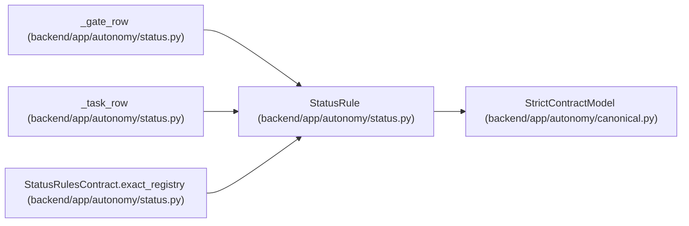

# StatusRule

**Location:** `backend/app/autonomy/status.py:20`
**Kind:** Pydantic model
**Bases:** `StrictContractModel`
**Module:** [status](../modules/status.md)

## Description

_Auto-generated from `StatusRule` in `backend/app/autonomy/status.py`._

## Attributes

| Name | Type | Wire name | Required | Nullable | Default | Constraints | Examples | Description |
|------|------|-----------|----------|----------|---------|-------------|-------------|----------|
| `id` | `str` | `id` | Yes | No | — | pattern=unknown (IDENTIFIER_PATTERN) | — | — |
| `implementation` | `Literal['implemented_local'] \| None` | `implementation` | No | Yes | `None` | — | — | — |
| `required_evidence` | `tuple[str, ...]` | `required_evidence` | Yes | No | — | max_length=128; min_length=1 | — | — |
| `next_tasks` | `tuple[str, ...]` | `next_tasks` | Yes | No | — | max_length=32; min_length=1 | — | — |
| `terminal_boundary` | `Literal['manual_external', 'external_post_publication'] \| None` | `terminal_boundary` | No | Yes | `None` | — | — | — |

## Methods

*No public methods. Inherits from base classes.*

## Relationships

<!-- Auto-generated relationship summary. Do not edit by hand. -->

### Summary

| Module | Methods | Attributes |
|---|---:|---|
| [status](../modules/status.md) | 0 | `id`, `implementation`, `next_tasks`, `required_evidence`, `terminal_boundary` |

### Structure

| Kind | Entity | Module |
|---|---|---|
| Base | `StrictContractModel` | [autonomy_canonical](../modules/autonomy_canonical.md) |

### References

| Reference | Kind | Source | Call sites |
|---|---|---|---:|
| `_gate_row` | type_reference | [status](../modules/status.md) | — |
| `_task_row` | type_reference | [status](../modules/status.md) | — |
| `StatusRulesContract.exact_registry` | type_reference | [status](../modules/status.md) | — |
