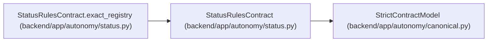

# StatusRulesContract

**Location:** `backend/app/autonomy/status.py:28`
**Kind:** Pydantic model
**Bases:** `StrictContractModel`
**Module:** [status](../modules/status.md)

## Description

_Auto-generated from `StatusRulesContract` in `backend/app/autonomy/status.py`._

## Validators

| Method | Scope | Fields | Mode | Options |
|--------|-------|--------|------|---------|
| `exact_registry` | model | — | after | — |

## Attributes

| Name | Type | Wire name | Required | Nullable | Default | Constraints | Examples | Description |
|------|------|-----------|----------|----------|---------|-------------|-------------|----------|
| `schema_version` | `Literal['workchord-postgresql-status-rules-v1']` | `schema_version` | Yes | No | — | — | — | — |
| `waiver_policy` | `Literal['forbidden']` | `waiver_policy` | Yes | No | — | — | — | — |
| `tasks` | `tuple[StatusRule, ...]` | `tasks` | Yes | No | — | max_length=256; min_length=1 | — | — |
| `gates` | `tuple[StatusRule, ...]` | `gates` | Yes | No | — | max_length=15; min_length=15 | — | — |

## Methods

| Method | Signature | Decorators | Description |
|--------|-----------|------------|-------------|
| `exact_registry` | `() -> 'StatusRulesContract'` | `@model_validator(mode='after')` | — |

## Relationships

<!-- Auto-generated relationship summary. Do not edit by hand. -->

### Summary

| Module | Methods | Attributes |
|---|---:|---|
| [status](../modules/status.md) | 1 | `gates`, `schema_version`, `tasks`, `waiver_policy` |

### Structure

| Kind | Entity | Module |
|---|---|---|
| Base | `StrictContractModel` | [autonomy_canonical](../modules/autonomy_canonical.md) |

### References

| Reference | Kind | Source | Call sites |
|---|---|---|---:|
| `StatusRulesContract.exact_registry` | type_reference | [status](../modules/status.md) | — |
