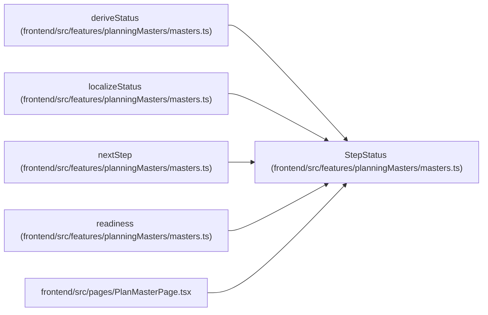

# StepStatus

**Location:** `frontend/src/features/planningMasters/masters.ts:8`
**Kind:** Class
**Bases:** —
**Module:** [planningMasters_masters](../modules/planningMasters_masters.md)

## Description

_Auto-generated from `StepStatus` in `frontend/src/features/planningMasters/masters.ts`._

## Attributes

| Name | Type | Required | Default | Description |
|------|------|----------|---------|-------------|
| `state` | `StepState` | Yes | — | — |
| `summary` | `string` | No | — | — |
| `missing` | `string[]` | No | — | — |

## Methods

*No public methods. Inherits from base classes.*

## Relationships

<!-- Auto-generated relationship summary. Do not edit by hand. -->

### Summary

| Module | Methods | Attributes |
|---|---:|---|
| [planningMasters_masters](../modules/planningMasters_masters.md) | 0 | `missing`, `state`, `summary` |

### References

| Reference | Kind | Source | Call sites |
|---|---|---|---:|
| `deriveStatus` | type_reference | [planningMasters_masters](../modules/planningMasters_masters.md) | — |
| `localizeStatus` | type_reference | [planningMasters_masters](../modules/planningMasters_masters.md) | — |
| `nextStep` | type_reference | [planningMasters_masters](../modules/planningMasters_masters.md) | — |
| `readiness` | type_reference | [planningMasters_masters](../modules/planningMasters_masters.md) | — |
| `PlanMasterPage` | import | [PlanMasterPage](../modules/PlanMasterPage.md) | — |
