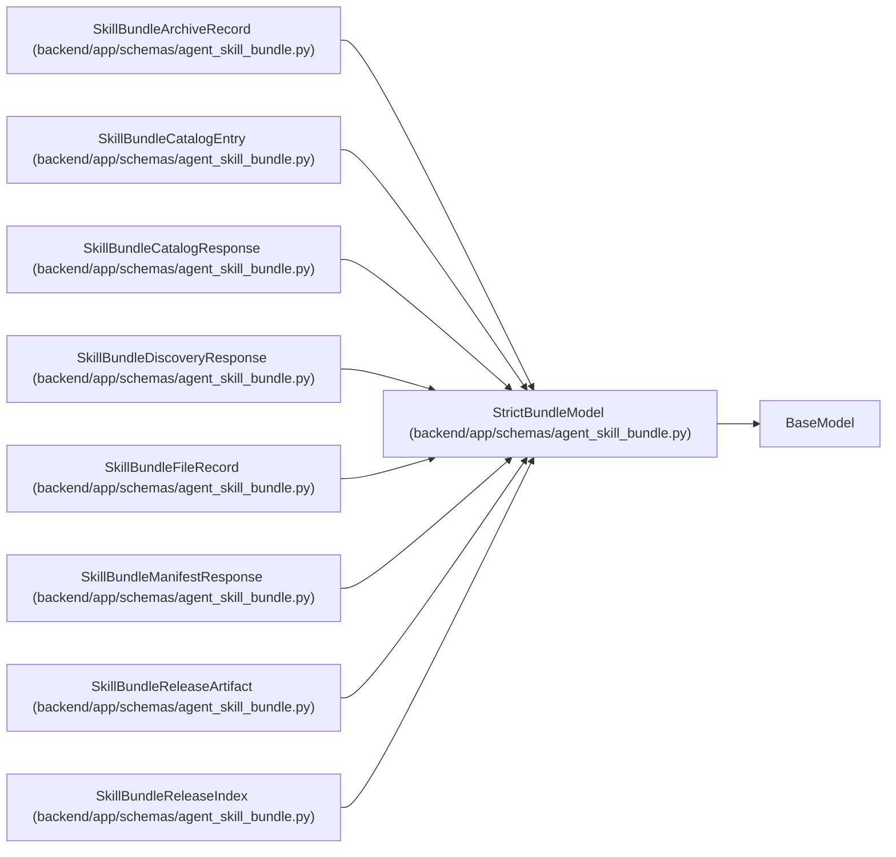

# StrictBundleModel

**Location:** `backend/app/schemas/agent_skill_bundle.py:13`
**Kind:** Pydantic model
**Bases:** `BaseModel`
**Module:** [agent_skill_bundle](../modules/agent_skill_bundle.md)

## Description

Reject undeclared build metadata instead of serving it accidentally.

## Model Configuration

| Setting | Value | Source |
|---------|-------|--------|
| `extra` | `'forbid'` | model_config |

## Attributes

*No annotated attributes found.*

## Methods

*No public methods. Inherits from base classes.*

## Relationships

<!-- Auto-generated relationship summary. Do not edit by hand. -->

### Summary

| Module | Methods | Attributes |
|---|---:|---|
| [agent_skill_bundle](../modules/agent_skill_bundle.md) | 0 | — |

### Structure

| Kind | Entity | Module |
|---|---|---|
| Base | `BaseModel` | — |
| Subclass | `SkillBundleArchiveRecord` | [agent_skill_bundle](../modules/agent_skill_bundle.md) |
| Subclass | `SkillBundleCatalogEntry` | [agent_skill_bundle](../modules/agent_skill_bundle.md) |
| Subclass | `SkillBundleCatalogResponse` | [agent_skill_bundle](../modules/agent_skill_bundle.md) |
| Subclass | `SkillBundleDiscoveryResponse` | [agent_skill_bundle](../modules/agent_skill_bundle.md) |
| Subclass | `SkillBundleFileRecord` | [agent_skill_bundle](../modules/agent_skill_bundle.md) |
| Subclass | `SkillBundleManifestResponse` | [agent_skill_bundle](../modules/agent_skill_bundle.md) |
| Subclass | `SkillBundleReleaseArtifact` | [agent_skill_bundle](../modules/agent_skill_bundle.md) |
| Subclass | `SkillBundleReleaseIndex` | [agent_skill_bundle](../modules/agent_skill_bundle.md) |
