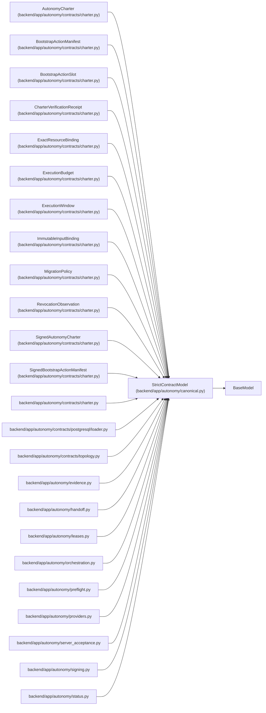

# StrictContractModel

**Location:** `backend/app/autonomy/canonical.py:22`
**Kind:** Pydantic model
**Bases:** `BaseModel`
**Module:** [autonomy_canonical](../modules/autonomy_canonical.md)

## Description

Base class shared by immutable, extra-forbidden contracts.

## Model Configuration

| Setting | Value | Source |
|---------|-------|--------|
| `extra` | `'forbid'` | model_config |
| `frozen` | `True` | model_config |
| `str_strip_whitespace` | `True` | model_config |
| `validate_default` | `True` | model_config |
| `allow_inf_nan` | `False` | model_config |

## Attributes

*No annotated attributes found.*

## Methods

*No public methods. Inherits from base classes.*

## Relationships

<!-- Auto-generated relationship summary. Do not edit by hand. -->

### Summary

| Module | Methods | Attributes |
|---|---:|---|
| [autonomy_canonical](../modules/autonomy_canonical.md) | 0 | — |

### Structure

| Kind | Entity | Module |
|---|---|---|
| Base | `BaseModel` | — |
| Subclass | `AutonomyCharter` | [charter](../modules/charter.md) |
| Subclass | `BootstrapActionManifest` | [charter](../modules/charter.md) |
| Subclass | `BootstrapActionSlot` | [charter](../modules/charter.md) |
| Subclass | `CharterVerificationReceipt` | [charter](../modules/charter.md) |
| Subclass | `ExactResourceBinding` | [charter](../modules/charter.md) |
| Subclass | `ExecutionBudget` | [charter](../modules/charter.md) |
| Subclass | `ExecutionWindow` | [charter](../modules/charter.md) |
| Subclass | `ImmutableInputBinding` | [charter](../modules/charter.md) |
| Subclass | `MigrationPolicy` | [charter](../modules/charter.md) |
| Subclass | `RevocationObservation` | [charter](../modules/charter.md) |
| Subclass | `SignedAutonomyCharter` | [charter](../modules/charter.md) |
| Subclass | `SignedBootstrapActionManifest` | [charter](../modules/charter.md) |

### References

| Reference | Kind | Source | Call sites |
|---|---|---|---:|
| `charter` | import | [charter](../modules/charter.md) | — |
| `loader` | import | [loader](../modules/loader.md) | — |
| `topology` | import | [topology](../modules/topology.md) | — |
| `evidence` | import | [evidence](../modules/evidence.md) | — |
| `handoff` | import | [handoff](../modules/handoff.md) | — |
| `leases` | import | [leases](../modules/leases.md) | — |
| `orchestration` | import | [orchestration](../modules/orchestration.md) | — |
| `preflight` | import | [preflight](../modules/preflight.md) | — |
| `providers` | import | [providers](../modules/providers.md) | — |
| `server_acceptance` | import | [autonomy_server_acceptance](../modules/autonomy_server_acceptance.md) | — |
| `signing` | import | [signing](../modules/signing.md) | — |
| `status` | import | [status](../modules/status.md) | — |

> References: showing 12 of 14 logical references; 2 omitted by the 12-row generated summary limit.
