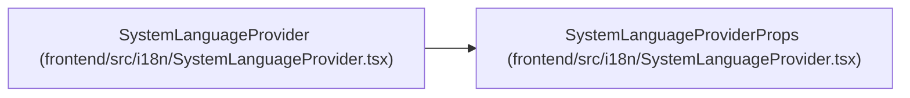

# SystemLanguageProviderProps

**Location:** `frontend/src/i18n/SystemLanguageProvider.tsx:9`
**Kind:** Class
**Bases:** —
**Module:** [SystemLanguageProvider](../modules/SystemLanguageProvider.md)

## Description

_Auto-generated from `SystemLanguageProviderProps` in `frontend/src/i18n/SystemLanguageProvider.tsx`._

## Attributes

| Name | Type | Default | Description |
|------|------|---------|-------------|
| `children` | `ReactNode` | *required* | — |

## Methods

*No public methods. Inherits from base classes.*

## Relationships

<!-- Auto-generated relationship summary. Do not edit by hand. -->

### Summary

| Module | Methods | Attributes |
|---|---:|---|
| [SystemLanguageProvider](../modules/SystemLanguageProvider.md) | 0 | `children` |

### References

| Reference | Kind | Source | Call sites |
|---|---|---|---:|
| `SystemLanguageProvider` | type_reference | [SystemLanguageProvider](../modules/SystemLanguageProvider.md) | — |
