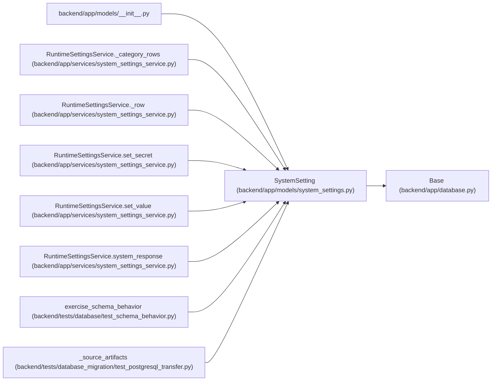

# SystemSetting

**Location:** `backend/app/models/system_settings.py:12`
**Kind:** Class
**Bases:** `Base`
**Module:** [models_system_settings](../modules/models_system_settings.md)

## Description

One catalogued runtime configuration value.

Non-secret settings store their JSON scalar/object in ``value_json``.
Secret settings store encrypted payloads in ``secret_ciphertext``.

## Attributes

| Name | Type | Default | Description |
|------|------|---------|-------------|
| `id` | `Mapped[int]` | `mapped_column(Integer, primary_key=True, autoincrement=True)` | — |
| `key` | `Mapped[str]` | `mapped_column(String(120), nullable=False, index=True)` | — |
| `category` | `Mapped[str]` | `mapped_column(String(80), nullable=False, index=True)` | — |
| `value_json` | `Mapped[Optional[Any]]` | `mapped_column(JSON, nullable=True)` | — |
| `secret_ciphertext` | `Mapped[Optional[str]]` | `mapped_column(Text, nullable=True)` | — |
| `is_secret` | `Mapped[bool]` | `mapped_column(Boolean, default=False, nullable=False)` | — |
| `created_at` | `Mapped[datetime]` | `mapped_column(UTCDateTime(), default=utc_now, nullable=False)` | — |
| `updated_at` | `Mapped[datetime]` | `mapped_column(UTCDateTime(), default=utc_now, onupdate=utc_now, nullable=False)` | — |

## Methods

*No public methods. Inherits from base classes.*

## Relationships

<!-- Auto-generated relationship summary. Do not edit by hand. -->

### Summary

| Module | Methods | Attributes |
|---|---:|---|
| [models_system_settings](../modules/models_system_settings.md) | 0 | `category`, `created_at`, `id`, `is_secret`, `key`, `secret_ciphertext`, `updated_at`, `value_json` |

### Structure

| Kind | Entity | Module |
|---|---|---|
| Base | `Base` | [app_database](../modules/app_database.md) |

### References

| Reference | Kind | Source | Call sites |
|---|---|---|---:|
| `__init__` | import | [models___init__](../modules/models___init__.md) | — |
| `RuntimeSettingsService._category_rows` | type_reference | [system_settings_service](../modules/system_settings_service.md) | — |
| `RuntimeSettingsService._row` | type_reference | [system_settings_service](../modules/system_settings_service.md) | — |
| `RuntimeSettingsService.set_secret` | call | [system_settings_service](../modules/system_settings_service.md) | 1 |
| `RuntimeSettingsService.set_secret` | type_reference | [system_settings_service](../modules/system_settings_service.md) | — |
| `RuntimeSettingsService.set_value` | call | [system_settings_service](../modules/system_settings_service.md) | 1 |
| `RuntimeSettingsService.set_value` | type_reference | [system_settings_service](../modules/system_settings_service.md) | — |
| `RuntimeSettingsService.system_response` | type_reference | [system_settings_service](../modules/system_settings_service.md) | — |
| `exercise_schema_behavior` | call | [test_schema_behavior](../modules/test_schema_behavior.md) | 2 |
| `_source_artifacts` | call | [test_postgresql_transfer](../modules/test_postgresql_transfer.md) | 2 |
