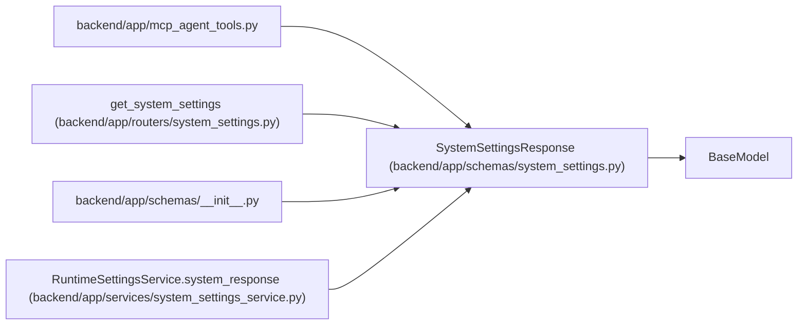

# SystemSettingsResponse

**Location:** `backend/app/schemas/system_settings.py:114`
**Kind:** Pydantic model
**Bases:** `BaseModel`
**Module:** [schemas_system_settings](../modules/schemas_system_settings.md)

## Description

Runtime configuration summary.

## Attributes

| Name | Type | Wire name | Required | Nullable | Default | Constraints | Examples | Description |
|------|------|-----------|----------|----------|---------|-------------|-------------|----------|
| `app` | `AppRuntimeSettingsResponse` | `app` | Yes | No | — | — | — | — |
| `llm` | `LLMRuntimeSettingsResponse` | `llm` | Yes | No | — | — | — | — |
| `github` | `GitHubRuntimeSettingsResponse` | `github` | Yes | No | — | — | — | — |
| `web_intake` | `WebIntakeRuntimeSettingsResponse` | `web_intake` | Yes | No | — | — | — | — |
| `restart_required` | `list[RestartRequiredSetting]` | `restart_required` | Yes | No | — | — | — | — |

## Methods

*No public methods. Inherits from base classes.*

## Relationships

<!-- Auto-generated relationship summary. Do not edit by hand. -->

### Summary

| Module | Methods | Attributes |
|---|---:|---|
| [schemas_system_settings](../modules/schemas_system_settings.md) | 0 | `app`, `github`, `llm`, `restart_required`, `web_intake` |

### Structure

| Kind | Entity | Module |
|---|---|---|
| Base | `BaseModel` | — |

### References

| Reference | Kind | Source | Call sites |
|---|---|---|---:|
| `mcp_agent_tools` | import | [mcp_agent_tools](../modules/mcp_agent_tools.md) | — |
| `get_system_settings` | type_reference | [routers_system_settings](../modules/routers_system_settings.md) | — |
| `__init__` | import | [schemas___init__](../modules/schemas___init__.md) | — |
| `RuntimeSettingsService.system_response` | call | [system_settings_service](../modules/system_settings_service.md) | 1 |
| `RuntimeSettingsService.system_response` | type_reference | [system_settings_service](../modules/system_settings_service.md) | — |
