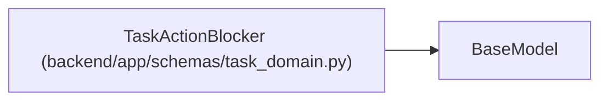

# TaskActionBlocker

**Location:** `backend/app/schemas/task_domain.py:30`
**Kind:** Pydantic model
**Bases:** `BaseModel`
**Module:** [schemas_task_domain](../modules/schemas_task_domain.md)

## Description

_Auto-generated from `TaskActionBlocker` in `backend/app/schemas/task_domain.py`._

## Attributes

| Name | Type | Wire name | Required | Nullable | Default | Constraints | Examples | Description |
|------|------|-----------|----------|----------|---------|-------------|-------------|----------|
| `code` | `str` | `code` | Yes | No | — | — | — | — |
| `message` | `str` | `message` | Yes | No | — | — | — | — |

## Methods

*No public methods. Inherits from base classes.*

## Relationships

<!-- Auto-generated relationship summary. Do not edit by hand. -->

### Summary

| Module | Methods | Attributes |
|---|---:|---|
| [schemas_task_domain](../modules/schemas_task_domain.md) | 0 | `code`, `message` |

### Structure

| Kind | Entity | Module |
|---|---|---|
| Base | `BaseModel` | — |
