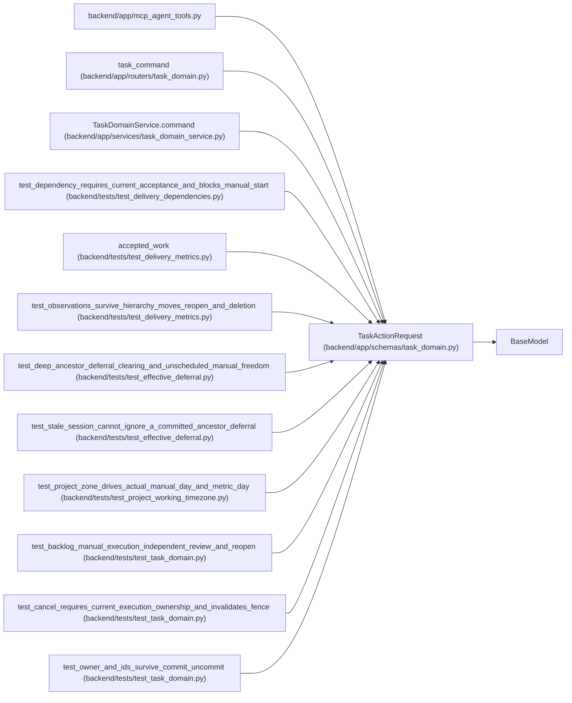

# TaskActionRequest

**Location:** `backend/app/schemas/task_domain.py:10`
**Kind:** Pydantic model
**Bases:** `BaseModel`
**Module:** [schemas_task_domain](../modules/schemas_task_domain.md)

## Description

_Auto-generated from `TaskActionRequest` in `backend/app/schemas/task_domain.py`._

## Model Configuration

| Setting | Value | Source |
|---------|-------|--------|
| `extra` | `'forbid'` | model_config |

## Validators

| Method | Scope | Fields | Mode | Options |
|--------|-------|--------|------|---------|
| `schedule_destination` | model | — | after | — |

## Attributes

| Name | Type | Wire name | Required | Nullable | Default | Constraints | Examples | Description |
|------|------|-----------|----------|----------|---------|-------------|-------------|----------|
| `action` | `TaskAction` | `action` | Yes | No | — | — | — | — |
| `expected_version` | `int` | `expected_version` | Yes | No | — | ge=1 | — | — |
| `reason` | `str` | `reason` | Yes | No | — | max_length=2000; min_length=1 | — | — |
| `iteration_id` | `int \| None` | `iteration_id` | No | Yes | `None` | ge=1 | — | — |
| `expected_revisions` | `dict[int, int]` | `expected_revisions` | No | No | factory: `dict` | — | — | — |
| `expected_claim_generation` | `int \| None` | `expected_claim_generation` | No | Yes | `None` | ge=0 | — | — |
| `expected_running_run_ids` | `list[int]` | `expected_running_run_ids` | No | No | factory: `list` | max_length=100 | — | — |
| `expected_live_assignment_ids` | `list[int]` | `expected_live_assignment_ids` | No | No | factory: `list` | max_length=100 | — | — |

## Methods

| Method | Signature | Decorators | Description |
|--------|-----------|------------|-------------|
| `schedule_destination` | `()` | `@model_validator(mode='after')` | — |

## Relationships

<!-- Auto-generated relationship summary. Do not edit by hand. -->

### Summary

| Module | Methods | Attributes |
|---|---:|---|
| [schemas_task_domain](../modules/schemas_task_domain.md) | 1 | `action`, `expected_claim_generation`, `expected_live_assignment_ids`, `expected_revisions`, `expected_running_run_ids`, `expected_version`, `iteration_id`, `reason` |

### Structure

| Kind | Entity | Module |
|---|---|---|
| Base | `BaseModel` | — |

### References

| Reference | Kind | Source | Call sites |
|---|---|---|---:|
| `mcp_agent_tools` | import | [mcp_agent_tools](../modules/mcp_agent_tools.md) | — |
| `task_command` | type_reference | [routers_task_domain](../modules/routers_task_domain.md) | — |
| `TaskDomainService.command` | type_reference | [task_domain_service](../modules/task_domain_service.md) | — |
| `test_dependency_requires_current_acceptance_and_blocks_manual_start` | call | [test_delivery_dependencies](../modules/test_delivery_dependencies.md) | 1 |
| `accepted_work` | call | [test_delivery_metrics](../modules/test_delivery_metrics.md) | 2 |
| `test_observations_survive_hierarchy_moves_reopen_and_deletion` | call | [test_delivery_metrics](../modules/test_delivery_metrics.md) | 1 |
| `test_deep_ancestor_deferral_clearing_and_unscheduled_manual_freedom` | call | [test_effective_deferral](../modules/test_effective_deferral.md) | 1 |
| `test_stale_session_cannot_ignore_a_committed_ancestor_deferral` | call | [test_effective_deferral](../modules/test_effective_deferral.md) | 1 |
| `test_project_zone_drives_actual_manual_day_and_metric_day` | call | [test_project_working_timezone](../modules/test_project_working_timezone.md) | 1 |
| `test_backlog_manual_execution_independent_review_and_reopen` | call | [test_task_domain](../modules/test_task_domain.md) | 3 |
| `test_cancel_requires_current_execution_ownership_and_invalidates_fence` | call | [test_task_domain](../modules/test_task_domain.md) | 3 |
| `test_owner_and_ids_survive_commit_uncommit` | call | [test_task_domain](../modules/test_task_domain.md) | 2 |

> References: showing 12 of 16 logical references; 4 omitted by the 12-row generated summary limit.
