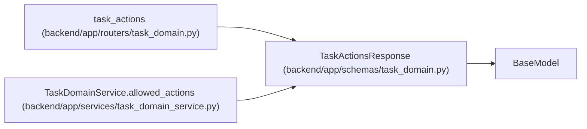

# TaskActionsResponse

**Location:** `backend/app/schemas/task_domain.py:41`
**Kind:** Pydantic model
**Bases:** `BaseModel`
**Module:** [schemas_task_domain](../modules/schemas_task_domain.md)

## Description

_Auto-generated from `TaskActionsResponse` in `backend/app/schemas/task_domain.py`._

## Attributes

| Name | Type | Wire name | Required | Nullable | Default | Constraints | Examples | Description |
|------|------|-----------|----------|----------|---------|-------------|-------------|----------|
| `task_id` | `int` | `task_id` | Yes | No | — | — | — | — |
| `version` | `int` | `version` | Yes | No | — | — | — | — |
| `actions` | `list[TaskActionAvailability]` | `actions` | Yes | No | — | — | — | — |
| `claim_generation` | `int` | `claim_generation` | Yes | No | — | — | — | — |
| `running_run_ids` | `list[int]` | `running_run_ids` | Yes | No | — | — | — | — |
| `live_assignment_ids` | `list[int]` | `live_assignment_ids` | Yes | No | — | — | — | — |

## Methods

*No public methods. Inherits from base classes.*

## Relationships

<!-- Auto-generated relationship summary. Do not edit by hand. -->

### Summary

| Module | Methods | Attributes |
|---|---:|---|
| [schemas_task_domain](../modules/schemas_task_domain.md) | 0 | `actions`, `claim_generation`, `live_assignment_ids`, `running_run_ids`, `task_id`, `version` |

### Structure

| Kind | Entity | Module |
|---|---|---|
| Base | `BaseModel` | — |

### References

| Reference | Kind | Source | Call sites |
|---|---|---|---:|
| `task_actions` | type_reference | [routers_task_domain](../modules/routers_task_domain.md) | — |
| `TaskDomainService.allowed_actions` | call | [task_domain_service](../modules/task_domain_service.md) | 1 |
