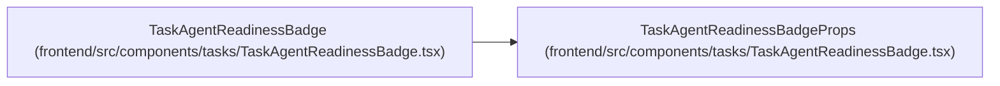

# TaskAgentReadinessBadgeProps

**Location:** `frontend/src/components/tasks/TaskAgentReadinessBadge.tsx:11`
**Kind:** Class
**Bases:** —
**Module:** [TaskAgentReadinessBadge](../modules/TaskAgentReadinessBadge.md)

## Description

_Auto-generated from `TaskAgentReadinessBadgeProps` in `frontend/src/components/tasks/TaskAgentReadinessBadge.tsx`._

## Attributes

| Name | Type | Required | Default | Description |
|------|------|----------|---------|-------------|
| `readiness` | `TaskAgentReadiness` | Yes | — | — |
| `mode` | `'compact' \| 'panel'` | No | — | — |

## Methods

*No public methods. Inherits from base classes.*

## Relationships

<!-- Auto-generated relationship summary. Do not edit by hand. -->

### Summary

| Module | Methods | Attributes |
|---|---:|---|
| [TaskAgentReadinessBadge](../modules/TaskAgentReadinessBadge.md) | 0 | `mode`, `readiness` |

### References

| Reference | Kind | Source | Call sites |
|---|---|---|---:|
| `TaskAgentReadinessBadge` | type_reference | [TaskAgentReadinessBadge](../modules/TaskAgentReadinessBadge.md) | — |
