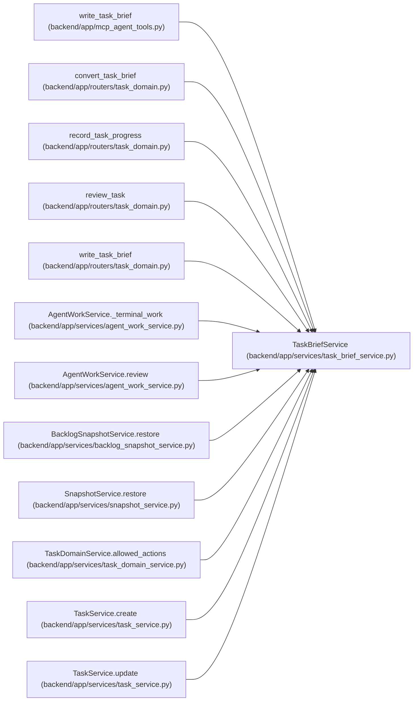

# TaskBriefService

**Location:** `backend/app/services/task_brief_service.py:140`
**Kind:** Class
**Bases:** —
**Module:** [task_brief_service](../modules/task_brief_service.md)

## Description

_Auto-generated from `TaskBriefService` in `backend/app/services/task_brief_service.py`._

## Attributes

*No annotated attributes found.*

## Methods

| Method | Signature | Decorators | Description |
|--------|-----------|------------|-------------|
| `__init__` | `(db)` | — | — |
| `tasks` | `()` | `@property` | — |
| `apply_brief` | *(async)* `(task: Task, brief: TaskBrief, *, provenance = 'structured') -> bool` | — | Apply one canonical representation under the task command's existing fence. |
| `restore_brief` | *(async)* `(task, snapshot)` | — | Keep restored legacy images inside an already adopted canonical boundary. |
| `write` | *(async)* `(task_id, data)` | `@atomic_command` | — |
| `conversion` | *(async)* `(task_id, data)` | — | — |
| `_locked` | *(async)* `(task_id, version)` | — | — |
| `write_progress` | *(async)* `(task_id: int, data: ProgressWrite, *, fenced_submission = False)` | `@atomic_command` | — |
| `require_review` | *(async)* `(task: Task, *, accepting: bool)` | — | One independence and evidence boundary for human and assigned-agent review. |
| `record_review` | *(async)* `(task, *, verdict, reason, evidence = '')` | — | — |
| `review` | *(async)* `(task_id: int, data: TaskReviewWrite)` | `@atomic_command` | — |

## Relationships

<!-- Auto-generated relationship summary. Do not edit by hand. -->

### Summary

| Module | Methods | Attributes |
|---|---:|---|
| [task_brief_service](../modules/task_brief_service.md) | 11 | — |

### References

| Reference | Kind | Source | Call sites |
|---|---|---|---:|
| `write_task_brief` | call | [mcp_agent_tools](../modules/mcp_agent_tools.md) | 1 |
| `convert_task_brief` | call | [routers_task_domain](../modules/routers_task_domain.md) | 1 |
| `record_task_progress` | call | [routers_task_domain](../modules/routers_task_domain.md) | 1 |
| `review_task` | call | [routers_task_domain](../modules/routers_task_domain.md) | 1 |
| `write_task_brief` | call | [routers_task_domain](../modules/routers_task_domain.md) | 1 |
| `AgentWorkService._terminal_work` | call | [agent_work_service](../modules/agent_work_service.md) | 1 |
| `AgentWorkService.review` | call | [agent_work_service](../modules/agent_work_service.md) | 2 |
| `BacklogSnapshotService.restore` | call | [backlog_snapshot_service](../modules/backlog_snapshot_service.md) | 1 |
| `SnapshotService.restore` | call | [snapshot_service](../modules/snapshot_service.md) | 1 |
| `TaskDomainService.allowed_actions` | call | [task_domain_service](../modules/task_domain_service.md) | 2 |
| `TaskService.create` | call | [task_service](../modules/task_service.md) | 1 |
| `TaskService.update` | call | [task_service](../modules/task_service.md) | 1 |

> References: showing 12 of 18 logical references; 6 omitted by the 12-row generated summary limit.
