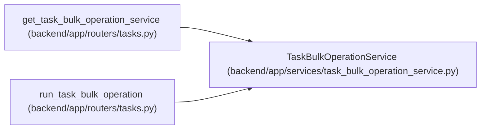

# TaskBulkOperationService

**Location:** `backend/app/services/task_bulk_operation_service.py:31`
**Kind:** Class
**Bases:** —
**Module:** [task_bulk_operation_service](../modules/task_bulk_operation_service.md)

## Description

Validate, preview, and apply selected-task bulk operations.

## Attributes

*No annotated attributes found.*

## Methods

| Method | Signature | Decorators | Description |
|--------|-----------|------------|-------------|
| `__init__` | `(db: AsyncSession)` | — | — |
| `run` | *(async)* `(data: TaskBulkOperationRequest) -> TaskBulkOperationResponse` | — | Run or preview one bulk operation for selected tasks. |
| `_run_for_task` | *(async)* `(task: Task, data: TaskBulkOperationRequest, iteration_end_date: Optional[Any], ui_language) -> TaskBulkOperationResult` | — | — |
| `_delete_task` | *(async)* `(task: Task, dry_run: bool, ui_language) -> TaskBulkOperationResult` | — | — |
| `_build_update` | *(async)* `(task: Task, data: TaskBulkOperationRequest, ui_language) -> tuple[TaskUpdate, dict[str, Any], Optional[AssigneeRecommendationResponse], list[str]]` | — | — |
| `_validate_update` | *(async)* `(task: Task, update: TaskUpdate) -> None` | — | — |
| `_changes_for_update` | `(task: Task, update: TaskUpdate) -> dict[str, Any]` | — | — |
| `_auto_assignee_for_task` | *(async)* `(task: Task, payload: dict[str, Any]) -> tuple[Optional[int], Optional[AssigneeRecommendationResponse], list[str]]` | — | — |
| `_status_transition_error` | `(task: Task, new_status: TaskStatus, ui_language) -> Optional[str]` | — | — |
| `_load_found_tasks` | *(async)* `(task_ids: list[int]) -> dict[int, Task]` | — | — |
| `_unique_task_ids` | `(task_ids: list[int]) -> list[int]` | — | — |
| `_task_tags` | `(task: Task) -> list[str]` | — | — |
| `_apply_label_delta` | `(current: list[str], labels: list[str], add: bool) -> list[str]` | — | — |
| `_required_labels` | `(payload: dict[str, Any]) -> list[str]` | — | — |
| `_required_int` | `(payload: dict[str, Any], key: str) -> int` | — | — |
| `_required_text` | `(payload: dict[str, Any], key: str) -> str` | — | — |
| `_optional_text` | `(value: Any) -> Optional[str]` | — | — |
| `_optional_float` | `(value: Any, default: float) -> float` | — | — |

## Relationships

<!-- Auto-generated relationship summary. Do not edit by hand. -->

### Summary

| Module | Methods | Attributes |
|---|---:|---|
| [task_bulk_operation_service](../modules/task_bulk_operation_service.md) | 18 | — |

### References

| Reference | Kind | Source | Call sites |
|---|---|---|---:|
| `get_task_bulk_operation_service` | call | [tasks](../modules/tasks.md) | 1 |
| `get_task_bulk_operation_service` | type_reference | [tasks](../modules/tasks.md) | — |
| `run_task_bulk_operation` | type_reference | [tasks](../modules/tasks.md) | — |
