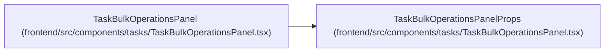

# TaskBulkOperationsPanelProps

**Location:** `frontend/src/components/tasks/TaskBulkOperationsPanel.tsx:24`
**Kind:** Class
**Bases:** —
**Module:** [TaskBulkOperationsPanel](../modules/TaskBulkOperationsPanel.md)

## Description

_Auto-generated from `TaskBulkOperationsPanelProps` in `frontend/src/components/tasks/TaskBulkOperationsPanel.tsx`._

## Attributes

| Name | Type | Default | Description |
|------|------|---------|-------------|
| `iterationId` | `number` | *required* | — |
| `selectedTasks` | `Task[]` | *required* | — |
| `selectedTaskIds` | `number[]` | *required* | — |
| `onClearSelection` | `() => void` | *required* | — |
| `onApplied` | `() => void` | *required* | — |

## Methods

*No public methods. Inherits from base classes.*

## Relationships

<!-- Auto-generated relationship summary. Do not edit by hand. -->

### Summary

| Module | Methods | Attributes |
|---|---:|---|
| [TaskBulkOperationsPanel](../modules/TaskBulkOperationsPanel.md) | 0 | `iterationId`, `onApplied`, `onClearSelection`, `selectedTaskIds`, `selectedTasks` |

### References

| Reference | Kind | Source | Call sites |
|---|---|---|---:|
| `TaskBulkOperationsPanel` | type_reference | [TaskBulkOperationsPanel](../modules/TaskBulkOperationsPanel.md) | — |
