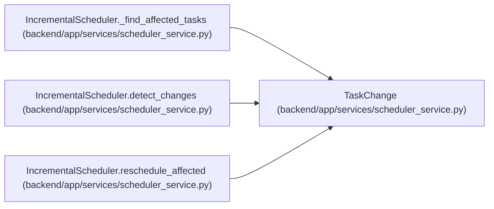

# TaskChange

**Location:** `backend/app/services/scheduler_service.py:38`
**Kind:** Class
**Bases:** —
**Module:** [scheduler_service](../modules/scheduler_service.md)

**Decorators:** `@dataclass`

## Description

Represents a change to a task for incremental rescheduling.

## Attributes

| Name | Type | Default | Description |
|------|------|---------|-------------|
| `task_id` | `int` | *required* | — |
| `iteration_id` | `int` | *required* | — |
| `change_type` | `ChangeType` | *required* | — |
| `old_value` | `Any` | `None` | — |
| `new_value` | `Any` | `None` | — |
| `assignee_id` | `Optional[int]` | `None` | — |

## Methods

*No public methods. Inherits from base classes.*

## Relationships

<!-- Auto-generated relationship summary. Do not edit by hand. -->

### Summary

| Module | Methods | Attributes |
|---|---:|---|
| [scheduler_service](../modules/scheduler_service.md) | 0 | `assignee_id`, `change_type`, `iteration_id`, `new_value`, `old_value`, `task_id` |

### References

| Reference | Kind | Source | Call sites |
|---|---|---|---:|
| `IncrementalScheduler._find_affected_tasks` | type_reference | [scheduler_service](../modules/scheduler_service.md) | — |
| `IncrementalScheduler.detect_changes` | call | [scheduler_service](../modules/scheduler_service.md) | 5 |
| `IncrementalScheduler.detect_changes` | type_reference | [scheduler_service](../modules/scheduler_service.md) | — |
| `IncrementalScheduler.reschedule_affected` | type_reference | [scheduler_service](../modules/scheduler_service.md) | — |
