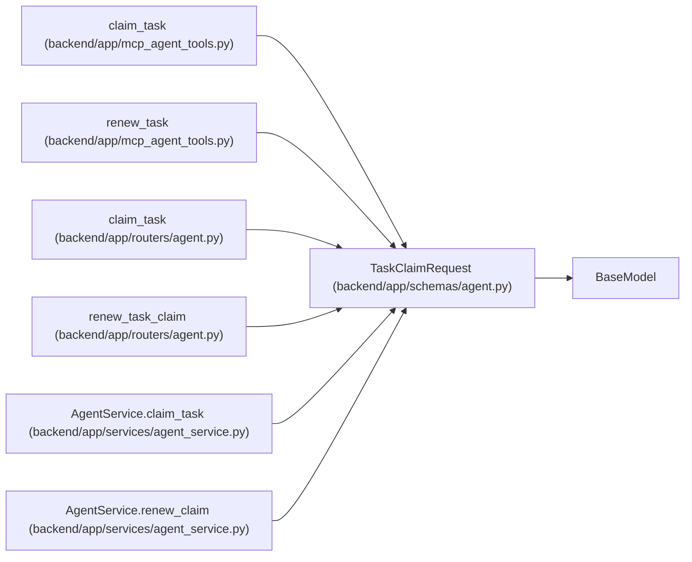

# TaskClaimRequest

**Location:** `backend/app/schemas/agent.py:247`
**Kind:** Pydantic model
**Bases:** `BaseModel`
**Module:** [schemas_agent](../modules/schemas_agent.md)

## Description

Request to claim or renew a task lease.

## Attributes

| Name | Type | Wire name | Required | Nullable | Default | Constraints | Examples | Description |
|------|------|-----------|----------|----------|---------|-------------|-------------|----------|
| `lease_seconds` | `int` | `lease_seconds` | No | No | `3600` | ge=60; le=86400 | — | — |
| `trace_id` | `Optional[str]` | `trace_id` | No | Yes | `None` | max_length=255 | — | — |
| `span_id` | `Optional[str]` | `span_id` | No | Yes | `None` | max_length=255 | — | — |
| `correlation_id` | `Optional[str]` | `correlation_id` | No | Yes | `None` | max_length=255 | — | — |
| `claim_id` | `Optional[str]` | `claim_id` | No | Yes | `None` | max_length=64; min_length=16 | — | — |
| `claim_generation` | `Optional[int]` | `claim_generation` | No | Yes | `None` | ge=1 | — | — |

## Methods

*No public methods. Inherits from base classes.*

## Relationships

<!-- Auto-generated relationship summary. Do not edit by hand. -->

### Summary

| Module | Methods | Attributes |
|---|---:|---|
| [schemas_agent](../modules/schemas_agent.md) | 0 | `claim_generation`, `claim_id`, `correlation_id`, `lease_seconds`, `span_id`, `trace_id` |

### Structure

| Kind | Entity | Module |
|---|---|---|
| Base | `BaseModel` | — |

### References

| Reference | Kind | Source | Call sites |
|---|---|---|---:|
| `claim_task` | call | [mcp_agent_tools](../modules/mcp_agent_tools.md) | 1 |
| `renew_task` | call | [mcp_agent_tools](../modules/mcp_agent_tools.md) | 1 |
| `claim_task` | type_reference | [routers_agent](../modules/routers_agent.md) | — |
| `renew_task_claim` | type_reference | [routers_agent](../modules/routers_agent.md) | — |
| `AgentService.claim_task` | type_reference | [agent_service](../modules/agent_service.md) | — |
| `AgentService.renew_claim` | type_reference | [agent_service](../modules/agent_service.md) | — |
